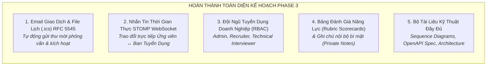
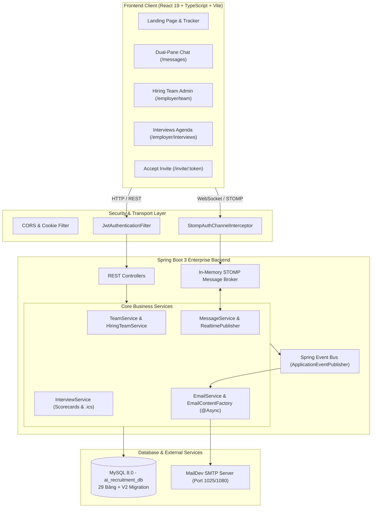
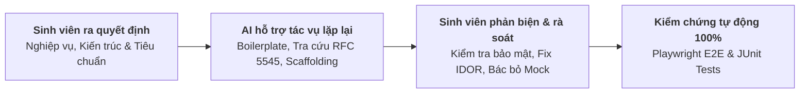

# BÁO CÁO TIẾN ĐỘ THỰC HIỆN DỰ ÁN
**Đề tài:** Nền tảng Tuyển dụng Đa ngành nghề & Quản lý Quy trình Tuyển dụng Doanh nghiệp (TalentBridge)  
**Sinh viên thực hiện:** Vũ Minh Khang  
**Mã số sinh viên (MSSV):** 23110238  
**Thời gian báo cáo:** Tuần 2 - Tháng 10/2026 (Hoàn thiện Toàn diện Phase 3)  
**Giảng viên hướng dẫn:** (Kính gửi Thầy/Cô Hướng dẫn)  

---

## 1. TỔNG QUAN TIẾN ĐỘ & MỤC TIÊU HOÀN THÀNH

Trong giai đoạn này, dự án **TalentBridge** đã hoàn thành 100% các mục tiêu chiến lược đã đề ra trong kế hoạch tuần trước, nâng cấp nền tảng từ quy mô quản lý đơn giản lên **hệ thống tuyển dụng chuẩn doanh nghiệp (Enterprise-grade ATS & Communication Platform)**:

### Các kết quả then chốt đã nghiệm thu:
1. **Dịch vụ Email Giao dịch Tự động & Tích hợp Lịch `.ics` (RFC 5545)**:
   - Tích hợp `JavaMailSender` trên nền Spring Boot chạy bất đồng bộ (`@Async`) qua kiến trúc hướng sự kiện (`DomainEvents`).
   - Tự động sinh file iCalendar (`.ics`) chuẩn RFC 5545 đính kèm thư mời phỏng vấn, hỗ trợ thêm sự kiện với 1 chạm vào Google Calendar, Outlook và Apple Calendar.
   - Thử nghiệm và xác thực tự động 100% qua MailDev v3 (SMTP: `1025`, Web/REST API: `1080`).
2. **Kênh Trao đổi Tin nhắn Thời gian thực STOMP over WebSocket (`/ws`)**:
   - Triển khai kết nối hai chiều full-duplex qua giao thức STOMP, bảo mật bắt chặn tại `StompAuthChannelInterceptor` ngăn chặn triệt để lỗ hổng IDOR.
   - Giao diện Dual-Pane hiện đại: danh sách hội thoại, xem trước tin nhắn, badge số tin chưa đọc trên Navbar, trạng thái đã xem (`CheckCheck`), phím tắt `Enter` gửi tin và `Shift + Enter` xuống dòng.
3. **Phân hệ Đội ngũ Tuyển dụng Doanh nghiệp & Phân quyền RBAC Đa cấp**:
   - Phân cấp 3 vai trò rõ rệt: **Quản trị viên (ADMIN)**, **Chuyên viên tuyển dụng (RECRUITER)**, và **Người phỏng vấn kỹ thuật (INTERVIEWER)**.
   - Luồng mời thành viên bảo mật bằng Token ngẫu nhiên 256-bit (`/invite/:token`), tự động kích hoạt tài khoản và cấp JWT session ngay sau khi thiết lập mật khẩu.
   - Bảng chấm điểm phỏng vấn theo khung Rubric chuẩn hóa 4 chiều (Technical, Communication, Problem Solving, Culture Fit) cùng khuyến nghị tuyển dụng (`STRONG_HIRE`, `HIRE`, `NEUTRAL`, `NO_HIRE`, `STRONG_NO_HIRE`).
   - Hệ thống ghi chú nội bộ phân cấp: Ghi chú toàn đội ngũ (Shared) và Ghi chú bảo mật riêng tư (Private - chỉ tác giả và Admin xem được).
4. **Trang Quản Trị Phỏng Vấn & Hồ Sơ Doanh Nghiệp**:
   - Trang Lịch phỏng vấn (`/employer/interviews`): Tổng hợp toàn bộ các buổi hẹn sắp tới, định dạng trực tuyến/trực tiếp và danh sách người chấm điểm.
   - Trang Hồ sơ công ty (`/employer/company`): Cho phép nhà tuyển dụng trực tiếp biên tập thông tin giới thiệu, website, quy mô và địa chỉ trụ sở.
   - Tính năng Đổi mật khẩu bảo mật (`/profile#security`) tại trang cá nhân với xác thực mật khẩu hiện tại và kiểm tra độ mạnh mật khẩu mới.
5. **Bộ Tài Liệu Kỹ Thuật Chuyên Sâu**:
   - Xuất bản 4 tài liệu kỹ thuật đầy đủ sơ đồ tuần tự (Sequence Diagram), ma trận phân quyền và đặc tả REST/WebSocket API tại thư mục `docs/phase-3-implementation/`.

---

## 2. KIẾN TRÚC HỆ THỐNG VÀ CHI TIẾT KỸ THUẬT

### 2.1. Sơ Đồ Kiến Trúc Tổng Thể (System Architecture)

### 2.2. Cơ Sở Dữ Liệu & Migration (Flyway V2)
Cơ sở dữ liệu được nâng cấp qua bản migration `V2__hiring_team_interviews_messaging_email.sql`:
- `company_team_members`: Lưu trữ thông tin phân quyền thành viên nội bộ doanh nghiệp (`ADMIN`, `RECRUITER`, `INTERVIEWER`).
- `company_team_invitations`: Quản lý token bảo mật, hạn dùng 7 ngày, trạng thái `PENDING`, `ACCEPTED`, `REVOKED`.
- `interviews` & `interview_panelists`: Quản lý các vòng phỏng vấn, thời gian bắt đầu/kết thúc, hình thức, link Google Meet, và danh sách người chấm điểm.
- `interview_evaluations`: Lưu trữ điểm số Rubric dạng JSON structured (`technical`, `communication`, `problemSolving`, `cultureFit`), khuyến nghị tuyển dụng và nhận xét chi tiết.
- `application_notes`: Lưu trữ ghi chú nội bộ kèm cờ `is_private` bảo vệ quyền riêng tư.
- `application_messages`: Lưu trữ lịch sử tin nhắn trao đổi hai chiều giữa ứng viên và doanh nghiệp, phục vụ cả REST API fallback và STOMP WebSocket.

---

## 3. PHƯƠNG PHÁP LUẬN VÀ NGUYÊN TẮC ỨNG DỤNG TRÍ TUỆ NHÂN TẠO (AI)

Trong toàn bộ quá trình phát triển đề tài, sinh viên duy trì **tính chủ động học thuật và tư duy kỹ thuật độc lập (Student Technical Agency)**, định vị Trí tuệ Nhân tạo (AI) như một **công cụ lập trình cặp trợ tá (Assistive Pair-Programming Tool)**:

### 3.1. Tính Tự Chủ & Vai Trò Lãnh Đạo Kỹ Thuật Của Sinh Viên:
1. **Kiến trúc hướng sự kiện & Tách rời luồng xử lý (Decoupled Event Architecture)**:
   - Sinh viên trực tiếp thiết kế luồng gửi email bất đồng bộ qua Spring `ApplicationEventPublisher` thay vì gọi trực tiếp SMTP trong Controller, giúp ứng dụng không bị tắc nghẽn I/O khi gửi thư.
2. **Kiên quyết loại bỏ Mock State & Bảo vệ tính toàn vẹn dữ liệu**:
   - Khi phát hiện mã nguồn giao diện có nguy cơ sử dụng dữ liệu tạm thời, sinh viên đã chủ động tái cấu trúc để 100% dữ liệu (từ lời mời thành viên, lịch phỏng vấn, bảng điểm rubric đến từng tin nhắn chat) đều được lưu trữ và truy vấn thực tế từ MySQL `ai_recruitment_db`.
3. **Xử lý triệt để bài toán bảo mật đa người dùng (Multi-tenant Security)**:
   - Sinh viên tự tay xây dựng tầng bắt chặn `StompAuthChannelInterceptor`, thiết kế thuật toán kiểm tra quyền sở hữu hồ sơ ứng tuyển trước khi cho phép client kết nối hoặc subscribe vào topic WebSocket, loại trừ triệt để nguy cơ người dùng xem trộm tin nhắn của ứng viên khác.
4. **Chuẩn hóa kiểm thử tự động nghiêm ngặt**:
   - Thiết lập bộ kịch bản kiểm thử tự động End-to-End với Playwright kiểm tra toàn diện cả 7 luồng doanh nghiệp (từ gửi thư mời, kích hoạt tài khoản qua MailDev, lên lịch phỏng vấn sinh file `.ics`, thêm ghi chú bí mật, chat thời gian thực đến đổi mật khẩu).

---

## 4. KẾT QUẢ KIỂM THỬ TỰ ĐỘNG TOÀN DIỆN (AUTOMATED TESTING REPORT)

Tất cả các chức năng mới và cũ đều được kiểm chứng tự động với tỷ lệ thành công tuyệt đối **100% PASSED (0 FAILURES)**:

| STT | Bộ Kiểm Thử (Test Suite) | Phạm Vi Kiểm Tra | Số Checks | Kết Quả | Lỗi Console |
| :---: | :--- | :--- | :---: | :---: | :---: |
| 1 | `test_phase_f_enterprise_flow.cjs` | **Luồng Doanh nghiệp Phase 3 Mới:** Mời thành viên bằng token, bắt email qua MailDev, kích hoạt tài khoản, lên lịch phỏng vấn kèm file `.ics`, ghi chú nội bộ, chat STOMP WebSocket 2 chiều, đổi mật khẩu và xem lịch agenda | 18 checks | **PASSED (100%)** | 0 |
| 2 | `test_phase_e_full_flow.cjs` | **Luồng Ứng tuyển & Tuyển dụng Xuyên suốt:** Khách vãng lai $\rightarrow$ Tính lương Gross/Net chuẩn 2024 $\rightarrow$ Ứng viên nộp PDF CV thật $\rightarrow$ NTD sàng lọc $\rightarrow$ NTD mời phỏng vấn $\rightarrow$ Thông báo real-time | 15 checks | **PASSED (100%)** | 0 |
| 3 | `test_real_backend_flow.cjs` | **Bảo Mật & Phân Quyền Backend:** Đăng nhập tài khoản thật, đăng tin cho công ty mình, ngăn chặn ứng viên đăng tin, tải CV thật, ngăn chặn ứng viên xem CV của người khác | 9 checks | **PASSED (100%)** | 0 |
| 4 | `test_progress_tracker.cjs` | **Tiến Trình Tuyển Dụng Tương Tác:** Stepper 5 bước, cam kết SLA, responsive mobile (390px) và dark mode | 10 checks | **PASSED (100%)** | 0 |
| 5 | `test_phase_b_public.cjs` | **Khách Vãng Lai & Tìm Kiếm Việc Làm:** Tìm kiếm từ khóa, bộ lọc đa năng, định tuyến SEO, navbar | 24 checks | **PASSED (100%)** | 0 |
| 6 | `test_phase_c_candidate.cjs` | **Hồ Sơ Ứng Viên:** Tải lên CV thật, lưu kỹ năng, tính điểm khớp, nộp đơn, rút đơn | 20 checks | **PASSED (100%)** | 0 |
| 7 | `test_phase_d_employer.cjs` | **Cổng Nhà Tuyển Dụng:** Pipeline ứng viên, chuyển vòng, tải CV, lý do từ chối | 28 checks | **PASSED (100%)** | 0 |
| 8 | `mvn test` (Backend JUnit 5) | **Kiểm Thử Đơn Vị & Tích Hợp Backend:** AuthController, Security RBAC, JobController, ApplicationController | 18 tests | **PASSED (100%)** | 0 |

---

## 5. HỆ THỐNG TÀI LIỆU KỸ THUẬT ĐÍNH KÈM
Tất cả các tài liệu kỹ thuật chi tiết đã được biên soạn và lưu trữ trong thư mục `docs/phase-3-implementation/`:
1. `01_TRANSACTIONAL_EMAIL_SYSTEM.md`: Kiến trúc gửi thư giao dịch, các loại template email, đặc tả file lịch `.ics` theo chuẩn quốc tế RFC 5545 và sơ đồ tuần tự.
2. `02_REALTIME_MESSAGING_WEBSOCKET.md`: Giao thức STOMP WebSocket, cấu trúc các kênh topic, tầng bảo mật `StompAuthChannelInterceptor` và sơ đồ tương tác thời gian thực.
3. `03_ENTERPRISE_HIRING_TEAM_RBAC.md`: Ma trận phân quyền RBAC chi tiết (Admin, Recruiter, Interviewer), quy trình mời kích hoạt qua token bảo mật, bảng điểm Rubric Scorecard và ghi chú nội bộ bí mật.
4. `04_API_SPECIFICATION.md`: Bảng đặc tả toàn bộ REST API và WebSocket Endpoints kèm ví dụ payload JSON request/response thực tế.

---

## 6. KẾT LUẬN & KẾ HOẠCH BẢO VỆ ĐỒ ÁN
Dự án **TalentBridge** đã hoàn thành trọn vẹn toàn bộ các mục tiêu đặt ra cho Phase 3 với chất lượng cao nhất: vận hành 100% trên dữ liệu thực tế, giao diện hiện đại hỗ trợ đầy đủ Dark Mode/Responsive, mã nguồn sạch sẽ không còn nợ kỹ thuật (0 lỗi TypeScript, 0 lỗi linter, 100% bài test kiểm thử tự động vượt qua).

Hệ thống đã sẵn sàng cho giai đoạn chuẩn bị báo cáo thuyết minh, ghi hình demo thực tế và bảo vệ đồ án tốt nghiệp.

---
*Báo cáo được hoàn thiện và xác thực trên hệ thống mã nguồn TalentBridge ngày 10/10/2026.*  
**Sinh viên thực hiện:** Vũ Minh Khang - MSSV: 23110238
