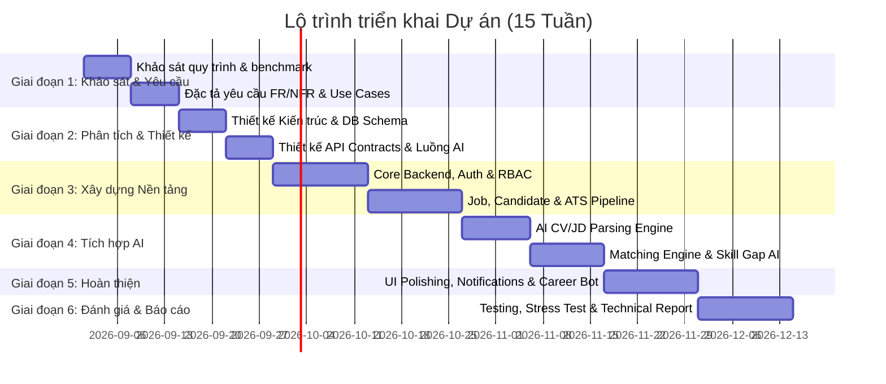

# KẾ HOẠCH TỔNG THỂ DỰ ÁN (MASTER PROJECT PLAN)
# NỀN TẢNG HỖ TRỢ TUYỂN DỤNG VÀ ĐỊNH HƯỚNG NGHỀ NGHIỆP TÍCH HỢP AI
*(AI-Driven Talent Acquisition & Career Pathing Platform)*

---

## 1. THÔNG TIN CHUNG ĐỀ TÀI

- **Tên đề tài**: Xây dựng nền tảng hỗ trợ tuyển dụng và định hướng nghề nghiệp tích hợp trí tuệ nhân tạo.
- **Mã định danh dự án**: `AI-TalentBridge` (hoặc `SmartCareer-Platform`).
- **Cấp độ thực hiện**: Tiểu luận chuyên ngành (Định hướng mở rộng cho Khóa luận tốt nghiệp).
- **Tư duy thiết kế**: Hệ thống quy mô lớn (Enterprise-Grade & High Scalability), áp dụng kiến trúc chuẩn mực ngay từ đầu để **triệt tiêu nợ kỹ thuật (Zero Technical Debt)**, đảm bảo khả năng mở rộng hàng triệu hồ sơ và hàng chục nghìn tin tuyển dụng.

---

## 2. MỤC TIÊU VÀ SỨ MỆNH HỆ THỐNG

### 2.1. Mục tiêu cốt lõi
1. **Kết nối hai đầu thị trường lao động (Two-Sided Marketplace)**: Giải quyết sự đứt gãy thông tin giữa Ứng viên (đặc biệt là sinh viên, fresher) và Nhà tuyển dụng (HR/Recruiter).
2. **Khách quan hóa & Minh bạch hóa quy trình tuyển dụng**: Thay thế cơ chế lọc từ khóa sơ sài (keyword-matching) bằng mô hình phân tích ngữ nghĩa sâu (Semantic & Contextual Matching) thông qua AI.
3. **Đóng kín chu trình Tuyển dụng & Đào tạo (Closing the Loop)**: Khi ứng viên chưa đạt yêu cầu của một công việc, hệ thống không chỉ từ chối mà còn chỉ ra **Khoảng cách kỹ năng (Skill Gap)** và đề xuất **Lộ trình học tập (Career Roadmap)** để ứng viên hoàn thiện năng lực.
4. **Nâng cao hiệu suất tuyển dụng (Hiring Velocity)**: Giảm 70% thời gian sàng lọc CV cho Recruiter nhờ trích xuất thông tin tự động, xếp hạng độ phù hợp có kèm lời giải thích (Explainable AI Score).

### 2.2. Triết lý kiến trúc (Architectural Philosophy)
Để xây dựng một hệ thống quy mô lớn mà không gặp nợ kỹ thuật, dự án tuân theo các nguyên tắc:
- **Clean Architecture & Domain-Driven Design (DDD)**: Tách biệt hoàn toàn Business Logic khỏi Framework, Database và External AI APIs.
- **Modular Monolith First, Microservices Ready**: Tổ chức mã nguồn thành các module độc lập có ranh giới rõ ràng (Bounded Contexts), giao tiếp qua Domain Events / Internal Contracts. Khi cần scale, bất kỳ module nào (như AI Matching hay CV Parser) đều có thể tách thành microservice độc lập mà không cần viết lại mã nguồn.
- **Asynchronous & Event-Driven for AI Workloads**: Các tác vụ AI nặng (phân tích CV, tính toán embedding vector, matching) được đưa vào Message Queue (RabbitMQ/Kafka) để xử lý bất đồng bộ, tránh nghẽn thread và đảm bảo trải nghiệm người dùng tức thì.
- **AI-Human in the Loop**: AI đóng vai trò là Copilot (hỗ trợ gợi ý, xếp hạng, giải thích), quyền quyết định cuối cùng và chỉnh sửa luôn thuộc về người dùng (ứng viên duyệt lại thông tin CV đã parse, recruiter xác nhận kết quả phỏng vấn).

---

## 3. LỘ TRÌNH THỰC HIỆN TOÀN DIỆN (15 TUẦN)

### Chi tiết từng giai đoạn:
- **Giai đoạn 1 — Khảo sát và xác định yêu cầu (Tuần 1–2)**:
  - Phân tích sâu quy trình tuyển dụng chuẩn quốc tế và tại Việt Nam.
  - Khảo sát các nền tảng hàng đầu (LinkedIn, TopCV, Greenhouse, Eightfold.ai).
  - Xác định Stakeholders, User Personas chi tiết.
  - Đặc tả 100% Yêu cầu chức năng (FR) và Yêu cầu phi chức năng (NFR) chuẩn Enterprise.
  - Xác định phạm vi (Scope Boundary: Tiểu luận vs Khóa luận).
  - Xây dựng mô hình Use Case chi tiết.
- **Giai đoạn 2 — Phân tích và thiết kế hệ thống (Tuần 3–4)**:
  - Thiết kế kiến trúc Modular Monolith / Clean Architecture.
  - Thiết kế Data Model (Relational Schema cho PostgreSQL + Vector Schema cho pgvector / Qdrant).
  - Thiết kế RESTful API Contracts (OpenAPI/Swagger specification).
  - Thiết kế giao diện (Design System, Wireframes & UI Flow).
  - Thiết kế luồng xử lý AI (Prompt Engineering, Function Calling, Asynchronous Queue Workers, Rate Limiting & Fallback).
- **Giai đoạn 3 — Xây dựng nền tảng cốt lõi (Tuần 5–8)**:
  - Setup Repository, CI/CD pipeline, Docker environment.
  - Triển khai Core Backend, Database Migrations, Seed Data.
  - Triển khai Authentication & Authorization (JWT, Refresh Token, RBAC/ABAC).
  - Module Candidate Profile & Multi-version CV Manager.
  - Module Job Management (Đăng tin, kiểm duyệt, lọc trạng thái).
  - Module Application Tracking System (ATS Kanban Pipeline).
  - Dashboard cơ bản cho Recruiter và Candidate.
- **Giai đoạn 4 — Tích hợp Trí tuệ nhân tạo (Tuần 9–11)**:
  - Tích hợp LLM APIs (Gemini 1.5 Pro / Flash / GPT-4o-mini) với cơ chế JSON Schema enforcement.
  - Xây dựng CV Parser (PDF/DOCX to Structured JSON).
  - Xây dựng JD Analyzer (Trích xuất hard skills, soft skills, domain keywords, kinh nghiệm).
  - Xây dựng Candidate-Job Matching Engine (Hybrid: Semantic Vector Embedding + Rule-based Keyword Overlap).
  - Xây dựng Skill Gap Analysis Engine & Giải thích nguyên nhân phù hợp (Explainability).
  - Xây dựng Career Path & Course Recommendation.
- **Giai đoạn 5 — Hoàn thiện hệ thống & Nâng cao (Tuần 12–13)**:
  - Tinh chỉnh toàn diện giao diện Frontend (Responsive, UI/UX chuẩn Tailwind/AntDesign).
  - Hệ thống Real-time Notification (WebSocket/Server-Sent Events) & Email Transactional.
  - Module Interview Management (Lịch phỏng vấn, đánh giá ứng viên theo tiêu chí).
  - Tích hợp AI Career Assistant (Conversational Chatbot hỗ trợ ứng viên định hướng).
  - End-to-end integration testing & Bug fixing.
- **Giai đoạn 6 — Đánh giá, Kiểm thử và Báo cáo (Tuần 14–15)**:
  - Load testing & Stress testing (JMeter/k6) kiểm tra năng lực tải.
  - Đánh giá độ chính xác của AI matching (Precision/Recall trên tập dữ liệu mẫu).
  - Hoàn thiện tài liệu kỹ thuật (Architecture Decision Records - ADRs, API Docs).
  - Soạn thảo Báo cáo Tiểu luận chuyên ngành (Đầy đủ các chương mục học thuật).
  - Chuẩn bị Slide thuyết trình, Video kịch bản demo và phương án bảo vệ.

---

## 4. CHIẾN LƯỢC CÔNG NGHỆ (TECH STACK STRATEGY)

| Tầng hệ thống | Công nghệ đề xuất | Lý do lựa chọn (Đảm bảo Scale lớn & Không nợ kỹ thuật) |
| :--- | :--- | :--- |
| **Frontend Web** | **React.js / Next.js** (TypeScript) + Tailwind CSS + TanStack Query | Type safety tuyệt đối, Server-Side Rendering tối ưu SEO cho tin tuyển dụng, Cache state mạnh mẽ. |
| **Backend API** | **.NET 8 Web API** hoặc **Node.js (NestJS / TypeScript)** | .NET 8 có hiệu năng cực cao, hỗ trợ Clean Architecture, DI chuẩn mực, concurrency vượt trội. NestJS cũng là lựa chọn xuất sắc nếu team quen TypeScript. |
| **Primary Database** | **PostgreSQL 16** | RDBMS mạnh mẽ, ACID chuẩn, hỗ trợ JSONB cho dữ liệu CV linh hoạt, mở rộng lưu trữ lớn. |
| **Vector Database** | **pgvector** (extension trong PostgreSQL) hoặc **Qdrant** | Lưu trữ vector embeddings của CV và JD để thực hiện Semantic Search tốc độ mili-giây mà không cần duy trì cluster DB riêng biệt ban đầu. |
| **Caching & Queue** | **Redis** + **RabbitMQ** (hoặc Redis Streams / BullMQ) | Caching dữ liệu đọc nhiều (Jobs, Skills taxonomy); Queue quản lý các tác vụ AI phân tích nặng không làm nghẽn API chính. |
| **AI / LLM Engine** | **Google Gemini 1.5 Flash / Pro API** + LangChain / Semantic Kernel | Tốc độ cao, chi phí tối ưu, context window lớn (phân tích được CV/JD dài), hỗ trợ Structured JSON Outputs. |
| **File Storage** | **MinIO** / **AWS S3** / **Cloudinary** | Lưu trữ file CV gốc (PDF, DOCX), ảnh đại diện, bảo mật truy cập bằng Pre-signed URLs. |
| **Observability** | **Serilog + Seq** hoặc **OpenTelemetry + Prometheus + Grafana** | Giám sát hiệu năng, log truy vết từng request qua correlation ID, phát hiện tắc nghẽn sớm. |

---

## 5. QUY TẮC PHÁT TRIỂN & CHUẨN MỰC KỸ THUẬT (DEVELOPMENT STANDARDS)

1. **Strict Type Safety**: Mọi interface, DTO, Entity đều phải có kiểu dữ liệu rõ ràng. Cấm sử dụng kiểu dữ liệu lỏng lẻo (`any`, untyped objects) ở cả Frontend và Backend.
2. **Contract-First API**: Định nghĩa OpenAPI Spec trước hoặc tự động sinh Swagger kèm validation logic chặt chẽ (FluentValidation / Zod).
3. **Database Migration Control**: Toàn bộ thay đổi cơ sở dữ liệu phải thông qua file Migration, nghiêm cấm sửa trực tiếp schema trên database.
4. **Idempotency & Resilience**: Các API kích hoạt AI phải đảm bảo tính Idempotent, có cơ chế Retry with Exponential Backoff khi gọi các dịch vụ AI bên ngoài.
5. **Security Baseline**: Bắt buộc mã hóa PII (Personally Identifiable Information), áp dụng Rate Limiting chống DDoS, phân quyền Role-based chuẩn mực.
