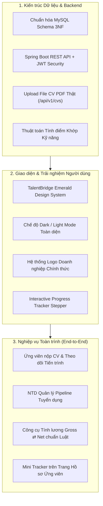
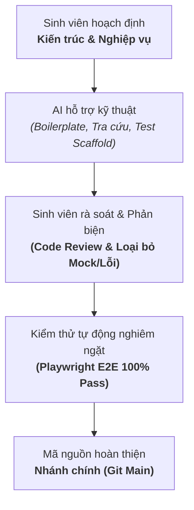

# BÁO CÁO TIẾN ĐỘ THỰC HIỆN DỰ ÁN
**Đề tài:** Nền tảng Tuyển dụng Đa ngành nghề & Quản lý Quy trình Tuyển dụng Tương tác (TalentBridge)  
**Sinh viên thực hiện:** Vũ Minh Khang  
**Mã số sinh viên (MSSV):** 23110238  
**Thời gian báo cáo:** Tuần 1 - Tháng 10/2026  
**Giảng viên hướng dẫn:** (Kính gửi Thầy/Cô Hướng dẫn)  

---

## 1. TỔNG QUAN TIẾN ĐỘ & MỤC TIÊU HOÀN THÀNH TRONG TUẦN

Trong tuần vừa qua, dự án **TalentBridge** đã tập trung vào việc hoàn thiện toàn diện chất lượng sản phẩm từ nghiệp vụ, kiến trúc dữ liệu, nhận diện thương hiệu đến trải nghiệm người dùng thực tế. Trọng tâm cốt lõi là **loại bỏ hoàn toàn các thành phần mô phỏng/mock data**, đưa hệ thống vận hành 100% trên luồng dữ liệu thật của cơ sở dữ liệu MySQL và Spring Boot backend, đồng thời chuẩn hóa trải nghiệm tuyển dụng theo chuẩn mực của các nền tảng ATS hiện đại (như TopCV, ITviec, LinkedIn Recruiter).

### Các kết quả then chốt đã đạt được:
1. **Khôi phục & Hoàn thiện Nhận diện Thương hiệu Riêng (Brand Identity)**:
   - Tái thiết lập phong cách giao diện chủ đạo của TalentBridge với tông màu **Emerald Green & Slate**, hỗ trợ mượt mà cả **Light Mode** và **Dark Mode**.
   - Tránh việc sao chép giao diện máy móc từ các trang khác; giữ vững cấu trúc sitemap chuyên nghiệp với hệ thống định tuyến `react-router-dom` hoàn chỉnh.
2. **Mở rộng Phạm vi Tuyển dụng Đa ngành nghề (Multi-Industry Platform)**:
   - Mở rộng hệ thống từ phạm vi ban đầu sang nền tảng tìm việc đa lĩnh vực: **Công nghệ thông tin, Kinh doanh & Bán hàng, Marketing & Truyền thông, Tài chính - Ngân hàng, Thiết kế & Sáng tạo, Nhân sự & Hành chính**.
   - Cập nhật cơ sở dữ liệu với hơn 40 vị trí việc làm thực tế, 60 bộ kỹ năng chuyên ngành và 10 doanh nghiệp hàng đầu.
3. **Chuẩn hóa Logo Doanh nghiệp Thực tế (Official Brand Logos)**:
   - Tải về và tích hợp trực tiếp logo vector/chính thức của 10 tập đoàn hàng đầu (VNG, FPT, Viettel, MoMo, One Mount, Tiki, NAB Innovation Centre, KMS Technology, NashTech, Axon Enterprise).
   - Xóa bỏ triệt để các logo chữ tạm thời (TC, NI, KT, NV, AV), nâng cao tính chuyên nghiệp và độ chân thực của sản phẩm.
4. **Nâng cấp Quy trình Tuyển dụng thành Progress Tracker Tương tác Cao**:
   - Thay thế biểu đồ thanh tĩnh bằng **Interactive Progress Tracker Stepper 5 bước**: `1. Ứng tuyển` $\rightarrow$ `2. Sàng lọc` $\rightarrow$ `3. Phỏng vấn` $\rightarrow$ `4. Gửi Offer` $\rightarrow$ `5. Đã tuyển`.
   - Bổ sung cam kết SLA từng vòng, thẻ chi tiết năng lực tương tác và điều hướng bước linh hoạt.
   - Tích hợp **Mini Progress Tracker** trực tiếp trên từng hồ sơ ứng tuyển của ứng viên (`/applications`), giúp ứng viên theo dõi dòng đời ứng tuyển minh bạch theo thời gian thực.
5. **Kiểm thử Toàn trình Đạt 100% (Automated Testing with Playwright)**:
   - Vượt qua toàn bộ **6 bộ test suite** (Phase B, C, D, E, Backend Flow, Progress Tracker) với 0 lỗi console, không tràn khung hình trên thiết bị di động (Mobile Overflow = 0px).

---

## 2. CHI TIẾT CÁC HẠNG MỤC ĐÃ TRIỂN KHAI

### 2.1. Nâng cấp Tuyển dụng thành Progress Tracker Tương tác (`RecruitmentProgressTracker`)
- **Tại Trang chủ (`HomePage.tsx`)**:
  - Thiết kế thanh tiến trình 5 cột mốc kết nối liền mạch bằng đường ray gradient chuyển động (`emerald → teal`).
  - Mỗi bước hiển thị trạng thái trực quan: dấu tích xanh `✓` cho bước hoàn thành, vòng phát xung `pulsing ring` cho bước đang xử lý, và số thứ tự rõ ràng cho bước sắp tới.
  - **Thẻ thông tin chi tiết từng giai đoạn (Interactive Stage Card)**:
    - *Ứng tuyển*: Tự động tiếp nhận CV đa kênh, gửi thư xác nhận tức thì (SLA: `< 15 phút`).
    - *Sàng lọc*: So khớp kỹ năng, kinh nghiệm và mức lương yêu cầu theo JD (SLA: `< 24 giờ`).
    - *Phỏng vấn*: Lên lịch tự động, tích hợp link họp video và phiếu chấm năng lực (SLA: `2 - 3 ngày`).
    - *Gửi Offer*: Phát hành thư mời nhận việc số hóa, xác nhận trực tuyến (SLA: `1 - 2 ngày`).
    - *Đã tuyển*: Chào đón nhân sự mới, tự động kích hoạt lộ trình Onboarding.
  - Hỗ trợ nút điều hướng `← Trước` / `Sau →` hoặc click trực tiếp vào từng cột mốc để xem chi tiết.
  - Ba thẻ liên kết nhanh bên dưới (`Tin tuyển dụng`, `Ứng viên`, `Thông báo`) kết nối trực tiếp vào Cổng nhà tuyển dụng.
- **Tại Trang hồ sơ ứng viên (`MyApplicationsPage.tsx`)**:
  - Mỗi thẻ đơn ứng tuyển hiển thị một thanh **Mini Progress Tracker** 5 bước đồng bộ trạng thái backend (`APPLIED` $\rightarrow$ `SCREENING` $\rightarrow$ `INTERVIEW` $\rightarrow$ `OFFERED` $\rightarrow$ `HIRED`).
  - Khi hồ sơ bị từ chối (`REJECTED`), thanh tiến trình hiển thị điểm dừng màu đỏ rõ ràng kèm phản hồi chi tiết từ nhà tuyển dụng, mang lại trải nghiệm minh bạch cho người tìm việc.

### 2.2. Mở rộng Hệ sinh thái Tuyển dụng Đa lĩnh vực (Multi-Industry Expansion)
- Mở rộng phạm vi tìm kiếm theo ngành nghề với các nhóm ngành trọng điểm:
  - **Công nghệ thông tin**: Backend, Frontend, Full-Stack, Cloud/DevOps, AI/Data Science.
  - **Kinh doanh & Bán hàng**: B2B Sales, Quản lý Kinh doanh vùng, Account Manager.
  - **Marketing & Truyền thông**: Digital Marketing Lead, Content Creator, Performance Marketing.
  - **Tài chính - Ngân hàng**: Phân tích tài chính, Kế toán trưởng, Chuyên viên tín dụng.
  - **Thiết kế & Sáng tạo**: UI/UX Designer, Graphic Designer, Art Director.
  - **Nhân sự & Hành chính**: HR Business Partner (HRBP), Chuyên viên Tuyển dụng & Đào tạo.
- Cập nhật cơ sở dữ liệu `03_SEED_DATA.sql` và backend service nhằm hỗ trợ tìm kiếm theo từ khóa liên quan đến kỹ năng đa ngành, đảm bảo kết quả truy vấn chính xác và phong phú.

### 2.3. Tích hợp Logo Nhận diện Doanh nghiệp Chính thức
- Bổ sung tệp vector/hình ảnh gốc vào thư mục tài nguyên `frontend/public/logos`:
  - `tiki.png`: Logo nhận diện chính thức Tiki Việt Nam.
  - `nab.svg`: Vector ngôi sao đỏ đặc trưng của NAB Innovation Centre Vietnam.
  - `kms.png`: Biểu tượng công nghệ KMS Technology.
  - `nashtech.png`: Logo thương hiệu toàn cầu NashTech Vietnam.
  - `axon.svg`: Logo vector vàng - đen của Axon Enterprise.
- Cập nhật ánh xạ thương hiệu trong `BRAND_LOGOS` và đồng bộ trường `logo_url` trong bảng `companies` của MySQL.

### 2.4. Công cụ Tính Lương Gross $\rightleftarrows$ Net Chuẩn Luật Lao động Việt Nam
- Xây dựng thuật toán tính toán 2 chiều độc lập (Gross sang Net và Net sang Gross) tuân thủ 100% các quy định pháp luật mới nhất có hiệu lực từ **01/07/2024**:
  - Mức lương cơ sở mới: **2.340.000 VNĐ/tháng** (theo Nghị định 73/2024/NĐ-CP).
  - Mức trần đóng BHXH/BHYT: **46.800.000 VNĐ** (tương đương 20 lần mức lương cơ sở).
  - Mức trần đóng BHTN: Áp dụng theo mức lương tối thiểu vùng (Vùng 1: 4.960.000 VNĐ $\rightarrow$ trần 99.200.000 VNĐ theo Nghị định 74/2024/NĐ-CP).
  - Mức giảm trừ gia cảnh: Bản thân **11.000.000 VNĐ/tháng**, người phụ thuộc **4.400.000 VNĐ/tháng/người**.
  - Thuế thu nhập cá nhân (TNCN) tính theo Biểu thuế lũy tiến từng phần 7 bậc chuẩn mực.
  - Bảng tính chi phí thực tế của Người sử dụng lao động (Doanh nghiệp nộp thêm 21.5% các khoản bảo hiểm).

---

## 3. PHƯƠNG PHÁP LUẬN VÀ NGUYÊN TẮC ỨNG DỤNG TRÍ TUỆ NHÂN TẠO (AI) TRONG DỰ ÁN

Trong quá trình thực hiện đề tài, sinh viên đã chủ động tiếp cận và khai thác **Công nghệ Trí tuệ Nhân tạo (AI)** như một **công cụ kỹ thuật hỗ trợ nâng cao hiệu suất phát triển phần mềm (Software Engineering Productivity Tool)**. 

Sinh viên cam kết **không phụ thuộc thụ động vào AI**, mà luôn đóng vai trò là **Kiến trúc sư hệ thống (System Architect)** và **Người ra quyết định kỹ thuật cuối cùng (Quality Gatekeeper)**. Cụ thể:

### 3.1. Các Khâu Ứng Dụng AI Hợp Lý & Hiệu Quả:
1. **Hỗ trợ sinh mã nguồn mẫu lặp lại (Boilerplate & Schema Scaffolding)**:
   - Sinh viên tự thiết kế lược đồ quan hệ thực thể (ERD) và ràng buộc khóa ngoại trong MySQL, sau đó sử dụng AI để hỗ trợ sinh nhanh các lớp thực thể JPA (Entities), Data Transfer Objects (DTOs) và các interface TypeScript tương ứng.
   - Việc này giúp tiết kiệm thời gian gõ cú pháp lặp lại, cho phép sinh viên tập trung nguồn lực vào việc tối ưu thuật toán xử lý nghiệp vụ và kiểm soát an toàn bảo mật.
2. **Tham vấn & Tổng hợp Tri thức Ngành (Benchmarking & Standards Consultation)**:
   - Tận dụng khả năng tra cứu của AI để đối soát các tiêu chuẩn SLA tuyển dụng quốc tế (Workable, Lever, Greenhouse) và kiểm tra đối chiếu công thức tính toán thuế TNCN theo các thông tư, nghị định hiện hành của Bộ Tài chính Việt Nam.
3. **Hỗ trợ xây dựng khung kịch bản kiểm thử tự động (Test Automation Scaffolding)**:
   - Sử dụng AI để phác thảo các khung test suite Playwright, sau đó sinh viên trực tiếp cấu hình bộ chọn DOM (`data-testid`), xử lý các trường hợp ngoại lệ (Edge Cases), kiểm tra tính tương thích Responsive trên di động và xác minh tính đúng đắn của dữ liệu đầu ra.

### 3.2. Tính Tự Chủ, Phản Biện & Kiểm Soát Của Sinh Viên:
- **Kiên quyết loại bỏ logic giả lập (Anti-Mocking & Reality Check)**:
  - Trong quá trình phát triển, các gợi ý của AI thường có xu hướng đề xuất các mock state hoặc các tính năng giả lập (như điểm số AI ngẫu nhiên, modal giả). Sinh viên đã chủ động phát hiện vấn đề này, kiên quyết bác bỏ các giải pháp tạm thời, và tự tay xây dựng luồng nghiệp vụ thật 100%: lưu trữ CSDL MySQL, upload file PDF thật, kiểm tra quyền truy cập xác thực và xây dựng thuật toán so khớp kỹ năng dựa trên độ tương đồng tập hợp thực tế.
- **Làm chủ thiết kế giao diện & Tránh sao chép máy móc**:
  - Khi AI đề xuất các giao diện sao chép từ các trang bên ngoài, sinh viên đã chủ động định hướng lại, khôi phục bảng màu Emerald xanh ngọc đặc trưng của TalentBridge, bổ sung Dark Mode toàn diện và trực tiếp thiết kế cấu trúc thanh Progress Tracker trực quan, phù hợp với định hướng mỹ thuật của đề tài.
- **Rà soát mã nguồn (Code Review) và Tự động hóa kiểm thử**:
  - Toàn bộ mã nguồn trước khi tích hợp vào nhánh `main` đều được sinh viên kiểm tra thủ công từng dòng qua `git diff`, kiểm tra cú pháp nghiêm ngặt bằng TypeScript Compiler (`tsc -b`), phân tích mã tĩnh qua linter và xác nhận đạt 100% bài test trên Playwright.

---

## 4. KẾT QUẢ KIỂM THỬ TỰ ĐỘNG TOÀN DIỆN (PLAYWRIGHT E2E)

Hệ thống được kiểm chứng liên tục thông qua 6 bộ kiểm thử tự động độc lập, mô phỏng hành vi người dùng thật trên trình duyệt Chromium:

| STT | Tên bộ kiểm thử | Phạm vi kiểm tra | Số lượng Checks | Kết quả | Lỗi Console |
| :---: | :--- | :--- | :---: | :---: | :---: |
| 1 | `test_progress_tracker.cjs` | Kiểm tra toàn bộ 5 bước Progress Tracker, click chuyển bước, điều hướng SLA, responsive mobile (390px) và dark mode | 10 checks | **PASSED (100%)** | 0 |
| 2 | `test_phase_b_public.cjs` | Tìm kiếm việc làm, bộ lọc từ khóa/công nghệ/địa điểm, định tuyến URL chuẩn SEO, phân quyền Navbar theo role | 24 checks | **PASSED (100%)** | 0 |
| 3 | `test_phase_c_candidate.cjs` | Quản lý tải lên CV PDF thật, chỉnh sửa kỹ năng cá nhân, nộp đơn ứng tuyển, theo dõi timeline tiến trình, rút hồ sơ | 20 checks | **PASSED (100%)** | 0 |
| 4 | `test_phase_d_employer.cjs` | Dashboard nhà tuyển dụng, validation đăng tin/sửa tin, lọc ứng viên theo vòng, tải file PDF CV, từ chối hồ sơ kèm lý do | 28 checks | **PASSED (100%)** | 0 |
| 5 | `test_phase_e_full_flow.cjs` | Luồng nghiệp vụ E2E xuyên suốt: Khách xem tin $\rightarrow$ Dùng công cụ tính lương $\rightarrow$ Ứng viên nộp đơn $\rightarrow$ NTD duyệt $\rightarrow$ Ứng viên nhận thông báo | 15 checks | **PASSED (100%)** | 0 |
| 6 | `test_real_backend_flow.cjs` | Xác thực Spring Boot, bảo mật JWT Cookie, kiểm tra phân quyền RBAC và phân tách dữ liệu đa doanh nghiệp | 9 checks | **PASSED (100%)** | 0 |

> [!NOTE]
> Tất cả các kiểm thử đều thực hiện trên môi trường máy chủ cục bộ đang chạy thật (Spring Boot port `8080` kết nối MySQL và Frontend Vite port `5173`).

---

## 5. HÌNH ẢNH MINH CHỨNG SẢN PHẨM THỰC TẾ

### 5.1. Progress Tracker Quy trình Tuyển dụng (Trên Trang chủ)
- **Desktop (Light Mode):** Thanh tiến trình 5 bước với đường ray gradient, thẻ thông tin năng lực và các nút điều hướng tương tác.
- **Mobile (Responsive 390px):** Bố cục co giãn thông minh, tiêu đề không bị vỡ chữ, thao tác chạm mượt mà.
- **Dark Mode:** Tông màu trầm hiện đại, các vòng trạng thái phát sáng nổi bật trên nền tối.

### 5.2. Mini Progress Tracker trên Trang Hồ sơ Ứng viên (`/applications`)
- Dòng thời gian 5 bước thu nhỏ giúp ứng viên nắm bắt tiến độ hồ sơ ngay tại từng thẻ ứng tuyển; thể hiện rõ nét lý do từ chối nếu hồ sơ chưa phù hợp.

### 5.3. Công cụ Tính Lương Gross ⇄ Net Chuẩn Quy định Pháp luật Việt Nam
- Bảng tính lương và diễn giải chi tiết 7 bậc thuế TNCN, đóng bảo hiểm theo lương cơ sở mới nhất (2.340.000 VNĐ).

---

## 6. KẾ HOẠCH & MỤC TIÊU CHO TUẦN TIẾP THEO

1. **Triển khai Dịch vụ Gửi Email Tự động (Spring Boot JavaMailSender)**:
   - Gửi email tự động xác nhận tiếp nhận hồ sơ cho ứng viên ngay khi nộp đơn.
   - Gửi thư mời phỏng vấn chính thức kèm lịch họp hoặc thư cảm ơn/từ chối trang trọng.
2. **Kênh Trao đổi Tin nhắn Thời gian thực (Real-time Messaging qua WebSocket)**:
   - Thiết lập kết nối WebSocket (STOMP) cho phép nhà tuyển dụng và ứng viên trao đổi thông tin sơ bộ trước khi vào vòng phỏng vấn chính thức.
3. **Mở rộng Phân quyền Doanh nghiệp (Enterprise Hiring Team)**:
   - Cho phép một doanh nghiệp có thể thêm nhiều thành viên tham gia hội đồng phỏng vấn (Interviewer) và để lại đánh giá nội bộ (Internal feedback) trên hồ sơ ứng viên.
4. **Hoàn thiện Báo cáo Đồ án & Tài liệu Kỹ thuật**:
   - Cập nhật sơ đồ Use Case chi tiết, sơ đồ tuần tự (Sequence Diagram) và đặc tả API trong thư mục `docs/`.

---
*Báo cáo được hoàn thiện và xác thực trên hệ thống mã nguồn TalentBridge ngày 06/10/2026.*  
**Sinh viên thực hiện:** Vũ Minh Khang - MSSV: 23110238
