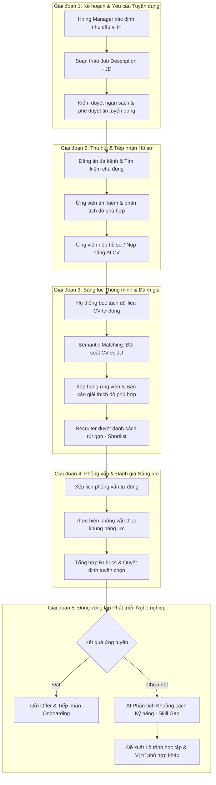

# TÀI LIỆU 01: PHÂN TÍCH QUY TRÌNH TUYỂN DỤNG & VÒNG ĐỜI NGHỀ NGHIỆP
# (COMPREHENSIVE RECRUITMENT LIFECYCLE & CAREER PATHING ANALYSIS)

---

## 1. TỔNG QUAN VỀ QUY TRÌNH TUYỂN DỤNG HIỆN ĐẠI (TALENT ACQUISITION)

Trong bối cảnh kỷ nguyên số và sự bùng nổ của thị trường lao động công nghệ, quy trình tuyển dụng không còn đơn thuần là việc "Đăng tin tuyển dụng và nhận hồ sơ gửi về email". Một hệ thống tuyển dụng quy mô doanh nghiệp (Enterprise Talent Acquisition) đòi hỏi sự phối hợp nhịp nhàng giữa nhiều chủ thể (Ứng viên, Recruiter, Hiring Manager, Interviewer) qua một chuỗi các giai đoạn khép kín.

### 1.1. Sơ đồ Vòng đời Tuyển dụng Toàn diện (End-to-End Recruitment Lifecycle)



---

## 2. PHÂN TÍCH CHI TIẾT HÀNH TRÌNH HAI ĐẦU (TWO-SIDED JOURNEY MAPPING)

### 2.1. Hành trình Ứng viên (Candidate Journey)
Đối với ứng viên — đặc biệt là nhóm đối tượng sinh viên sắp ra trường, fresher và junior — hành trình tìm việc thường trải qua 5 bước:

1. **Khám phá và Định vị bản thân (Self-Discovery)**:
   - *Hành vi*: Ứng viên tổng hợp các đồ án môn học, chứng chỉ, kỹ năng tự học để viết CV.
   - *Rào cản*: Không biết trình bày CV chuẩn ATS, không định lượng được năng lực, hoang mang về vị trí công việc phù hợp trên thị trường.
2. **Tìm kiếm và Lọc cơ hội việc làm (Job Discovery)**:
   - *Hành vi*: Tìm kiếm việc làm trên các trang tuyển dụng thông qua từ khóa (ví dụ: "React Developer", "Intern Backend").
   - *Rào cản*: Tin tuyển dụng viết quá chung chung hoặc yêu cầu quá cao ("Fresher cần 2 năm kinh nghiệm"), khó đánh giá bản thân có đủ tiêu chuẩn hay không.
3. **Nộp hồ sơ (Application Submission)**:
   - *Hành vi*: Tải lên file PDF hoặc dùng CV trực tuyến để ứng tuyển.
   - *Rào cản*: Form nộp hồ sơ rườm rà, nhập lại thông tin nhiều lần, lo lắng CV rơi vào "hố đen tuyển dụng" (Application Black Hole).
4. **Tham gia phỏng vấn (Interview Engagement)**:
   - *Hành vi*: Nhận lời mời phỏng vấn, chuẩn bị kiến thức kỹ thuật và kỹ năng mềm.
   - *Rào cản*: Lịch phỏng vấn xung đột, không biết người phỏng vấn sẽ tập trung vào tiêu chí nào.
5. **Phản hồi và Tái định hướng (Post-Application & Growth)**:
   - *Hành vi*: Chờ đợi kết quả.
   - *Rào cản lớn nhất hiện nay*: 90% trường hợp trượt nhận được email mẫu lạnh lùng ("Rất tiếc hồ sơ của bạn chưa phù hợp...") mà **hoàn toàn không giải thích lý do**, khiến ứng viên bế tắc không biết cần học thêm gì.

### 2.2. Hành trình Nhà tuyển dụng & Hiring Manager (Recruiter / Manager Journey)

1. **Khởi tạo và Phê duyệt Requisition**:
   - Xác định rõ vai trò, mức lương trần/sàn, các kỹ năng bắt buộc (Must-have skills) và kỹ năng ưu tiên (Nice-to-have skills).
2. **Sàng lọc khối lượng lớn (Mass Screening Fatigue)**:
   - Một vị trí thực tập hoặc fresher có thể nhận từ 300 đến 1.000 CV chỉ trong 1 tuần.
   - Recruiter dành trung bình chỉ 6 đến 8 giây để lướt qua một CV. Dẫn đến nguy cơ bỏ sót nhân tài thực thụ (False Negatives) hoặc chọn nhầm ứng viên biết "trang trí từ khóa" (Keyword Gaming).
3. **Quản lý đường ống ứng viên (Talent Pipeline Management)**:
   - Chuyển trạng thái ứng viên qua các giai đoạn: `Applied -> Screening -> Interviewing -> Offered -> Hired -> Rejected`.
   - Cần một bảng Kanban trực quan, hỗ trợ cộng tác ghi chú (Internal Notes) giữa Recruiter và Kỹ sư phỏng vấn kỹ thuật.
4. **Đánh giá có cấu trúc (Structured Evaluation)**:
   - Sử dụng Rubrics (bảng tiêu chí chuẩn hóa) để chấm điểm ứng viên về Technical, Communication, Cultural Fit thay vì đánh giá cảm tính.

---

## 3. CÁC ĐIỂM NGHẼN CỦA HỆ THỐNG TRUYỀN THỐNG VÀ GIẢI PHÁP ĐỘT PHÁ CỦA NỀN TẢNG

| Điểm nghẽn truyền thống (Pain Points) | Hậu quả đối với Thị trường | Giải pháp kiến trúc của Nền tảng (Platform Architecture Solution) |
| :--- | :--- | :--- |
| **1. Lọc từ khóa thô sơ (Lexical Keyword Matching)** | Ứng viên có kỹ năng tương đương (ví dụ biết *PostgreSQL* nhưng JD ghi *MySQL*, hoặc dùng từ đồng nghĩa) bị loại oan. | **Hybrid Semantic Search**: Sử dụng Vector Embeddings kết hợp trích xuất thực thể AI (Named Entity Recognition) để hiểu ngữ cảnh kỹ năng tương đương. |
| **2. Bẫy từ khóa (ATS Keyword Gaming)** | Ứng viên copy toàn bộ nội dung JD dán vào CV với chữ trắng/font nhỏ để vượt qua hệ thống ATS cổ điển. | **Contextual Verification**: AI phân tích sâu dự án thực tế, thời lượng kinh nghiệm và ngữ cảnh áp dụng công nghệ trong CV thay vì chỉ đếm tần suất xuất hiện từ khóa. |
| **3. "Hố đen tuyển dụng" (The Black Hole Effect)** | Ứng viên mất động lực, không nhận được bất kỳ phản hồi xây dựng nào từ nhà tuyển dụng. | **Explainable AI Matching**: Hệ thống công khai bảng phân tích: Kỹ năng phù hợp, Kỹ năng cần trau dồi, và Kỹ năng còn thiếu ngay trên giao diện ứng viên. |
| **4. Đứt gãy giữa Tuyển dụng và Đào tạo** | Các trang tuyển dụng chỉ đóng vai trò "chợ việc làm", từ chối xong là kết thúc chu trình. | **Closed-loop Career Engine**: Tự động kích hoạt module *Skill Gap Analysis* và xây dựng *Career Learning Roadmap* khi ứng viên chưa đạt điểm chuẩn của công việc. |
| **5. Quản lý phân tán, mất tính đồng bộ** | CV lưu trong Google Drive, trao đổi qua Zalo/Email, lịch phỏng vấn hẹn qua Excel gây thất lạc dữ liệu. | **All-in-One ATS Kanban Board**: Tích hợp toàn diện quản lý ứng viên, lịch phỏng vấn, rubrics đánh giá tập trung tại một cơ sở dữ liệu duy nhất. |

---

## 4. VÒNG LẶP PHẢN HỒI NGHỀ NGHIỆP ĐÓNG KÍN (CLOSING THE CAREER FEEDBACK LOOP)

Điểm khác biệt chiến lược của nền tảng nằm ở cơ chế **Đóng vòng lặp**:

```
[Ứng viên Nộp CV]
       │
       ▼
[AI Phân tích & Matching]
       │
   ┌───┴───────────────────────────────┐
   ▼                                   ▼
[Độ phù hợp Cao: >= 75%]        [Độ phù hợp Chưa Đạt: < 75%]
   │                                   │
   ▼                                   ▼
[Đưa vào Shortlist ATS]         [AI Kích hoạt Skill Gap Analysis]
   │                                   │
   ▼                                   ▼
[Mời Phỏng vấn]                 [Chỉ rõ: Thiếu gì? Vì sao trượt?]
                                       │
                                       ▼
                                [Sinh Lộ trình học tập (Roadmap)]
                                       │
                                       ▼
                                [Gợi ý Khóa học / Dự án rèn luyện]
                                       │
                                       ▼
                                [Ứng viên cập nhật CV mới]
                                       │
                                       └───> (Quay lại vòng lặp với vị thế tốt hơn)
```

Cơ chế này biến sự từ chối (Rejection) thành động lực phát triển (Growth Incentive), giúp người học định hướng rõ ràng lộ trình phát triển kỹ năng phù hợp với yêu cầu thực tế của thị trường tuyển dụng.
