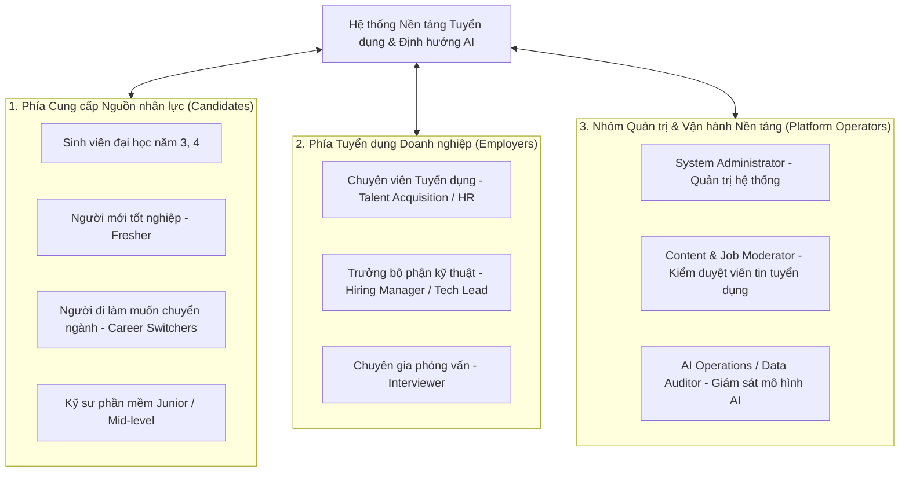

# TÀI LIỆU 03: XÁC ĐỊNH ĐỐI TƯỢNG SỬ DỤNG & XÂY DỰNG HỒ SƠ NGƯỜI DÙNG
# (STAKEHOLDER IDENTIFICATION & USER PERSONAS)

---

## 1. PHÂN TÍCH CÁC BÊN LIÊN QUAN (STAKEHOLDER ANALYSIS)

Hệ thống được thiết kế phục vụ một hệ sinh thái người dùng đa dạng, được phân thành 3 nhóm chủ thể chính:

---

## 2. HỒ SƠ NGƯỜI DÙNG ĐIỂN HÌNH (DETAILED USER PERSONAS)

### Persona 1: Nguyễn Văn An — Sinh viên năm cuối tìm kiếm cơ hội Fresher / Intern
- **Tuổi**: 22 tuổi | **Địa điểm**: TP. Hồ Chí Minh / Hà Nội
- **Học vấn**: Sinh viên năm cuối ngành Kỹ thuật Phần mềm
- **Kinh nghiệm**: 0–6 tháng (Đã làm đồ án môn học, chưa có kinh nghiệm thực chiến tại doanh nghiệp)
- **Kỹ năng hiện có**: C#, .NET cơ bản, SQL Server, HTML/CSS, Git.
- **Tâm lý & Hành vi**:
  - Tự ti về CV vì chưa có kinh nghiệm làm việc thực tế.
  - Thường gửi hàng loạt CV (rải CV) đến 30–50 công ty mà không chỉnh sửa.
  - Bị sốc khi thấy hầu hết tin tuyển dụng Fresher đều đòi hỏi các công cụ lạ lẫm (Docker, Kubernetes, Redis, CI/CD).
- **Mục tiêu cốt lõi (Goals)**:
  - Muốn biết CV của mình hiện tại đạt bao nhiêu điểm theo chuẩn thị trường.
  - Cần biết chính xác nếu muốn làm "Backend .NET Developer" thì đang thiếu kỹ năng gì.
  - Cần một lộ trình từng bước (roadmap) để bù đắp kiến thức còn thiếu trong vòng 2–3 tháng tới.
- **Câu nói tiêu biểu (Quote)**:
  > *"Em nộp CV cả tháng nay nhưng toàn nhận lại email từ chối tự động. Em không biết đồ án của mình thiếu gì so với yêu cầu thực tế của doanh nghiệp để khắc phục."*

---

### Persona 2: Trần Thị Bích — Kỹ sư 2 năm kinh nghiệm muốn nâng cấp sự nghiệp (Mid-Career Transitioner)
- **Tuổi**: 25 tuổi | **Địa điểm**: Đà Nẵng / Remote
- **Hiện tại**: Junior Frontend Developer (React, JavaScript, CSS)
- **Mục tiêu chuyển đổi**: Muốn nâng cấp lên Full-Stack Developer hoặc học chuyên sâu về Next.js và Cloud Architecture để tăng lương 40%.
- **Thách thức**:
  - Thời gian rảnh hạn hẹp, không thể học dàn trải mọi thứ trên mạng.
  - Cần biết công nghệ nào đang được các công ty trả lương cao nhất hiện nay.
  - Muốn xem mức độ tương thích giữa kinh nghiệm hiện tại của mình với các vị trí Full-Stack trên thị trường.
- **Mục tiêu cốt lõi (Goals)**:
  - Quản lý nhiều phiên bản CV (1 bản chuyên Frontend, 1 bản định hướng Full-Stack).
  - Sử dụng AI để rà soát điểm yếu trong các dự án đã ghi trên CV.
  - Tìm kiếm công việc có mức lương và chế độ làm việc linh hoạt (hybrid/remote).
- **Câu nói tiêu biểu (Quote)**:
  > *"Tôi cần một công cụ chỉ ra chính xác các khoảng trống kỹ năng giữa vai trò Frontend hiện tại và Fullstack mục tiêu, để tôi tập trung học đúng trọng tâm trong 1 giờ mỗi tối."*

---

### Persona 3: Lê Hoàng Cường — Talent Acquisition Specialist (Recruiter tại Công ty Công nghệ)
- **Tuổi**: 28 tuổi | **Quy mô công ty**: 200 nhân sự
- **Khối lượng công việc**: Phụ trách tuyển đồng thời 5 vị trí kỹ thuật; nhận trung bình 400 CV/tuần.
- **Nỗi đau hàng ngày (Frustrations)**:
  - Quá tải đọc CV: Mất 3–4 tiếng mỗi ngày chỉ để mở file PDF, đọc lướt kỹ năng và loại các CV không liên quan.
  - CV "ảo": Ứng viên copy nguyên cả danh mục công nghệ vào mục kỹ năng nhưng dự án không hề sử dụng.
  - Lạc mất trạng thái: Trao đổi với ứng viên qua email, hẹn phỏng vấn qua Google Calendar, ghi chú qua file Excel dẫn đến nhầm lẫn và chậm trễ phản hồi.
- **Mục tiêu cốt lõi (Goals)**:
  - Tải lên một tập CV (hoặc nhận CV ứng tuyển) và được hệ thống xếp hạng tự động từ cao xuống thấp.
  - Nhìn thấy ngay tóm tắt phân tích: Ứng viên này mạnh về cái gì, thiếu cái gì so với JD mà không cần đọc hết 3 trang giấy.
  - Kéo thả ứng viên trên bảng Kanban trực quan và gửi email hẹn phỏng vấn theo mẫu có sẵn chỉ bằng 1 cú click.
- **Câu nói tiêu biểu (Quote)**:
  > *"Tôi cần AI đọc hiểu thực sự dự án của ứng viên chứ không phải chỉ đếm từ khóa. Tôi muốn biết ngay ứng viên này có đáp ứng được 3 kỹ năng bắt buộc trong JD hay không để shortlist trong 10 giây."*

---

### Persona 4: Phạm Minh Dũng — Engineering Manager / Hiring Manager
- **Tuổi**: 35 tuổi | **Vị trí**: Trưởng phòng Phát triển Phần mềm
- **Vai trò trong tuyển dụng**:
  - Soạn thảo và duyệt yêu cầu kỹ thuật cho JD.
  - Trực tiếp phỏng vấn vòng chuyên môn kỹ thuật (Technical Interview).
  - Ra quyết định tuyển chọn cuối cùng.
- **Thách thức**:
  - Không có thời gian đọc CV ứng viên trước giờ phỏng vấn.
  - Các câu hỏi phỏng vấn thường bị lặp lại hoặc thiếu chuẩn hóa, đánh giá mang tính cảm quan.
- **Mục tiêu cốt lõi (Goals)**:
  - Nhận bảng tóm tắt năng lực kỹ thuật của ứng viên kèm các điểm nghi vấn mà AI phát hiện (ví dụ: *"Ứng viên ghi có 2 năm kinh nghiệm Docker nhưng không có dự án triển khai cụ thể"*).
  - Có sẵn bảng tiêu chí đánh giá (Evaluation Rubrics) để chấm điểm ngay trong buổi phỏng vấn.
- **Câu nói tiêu biểu (Quote)**:
  > *"Tôi muốn hệ thống chỉ ra những điểm còn mù mờ trong CV của ứng viên để tôi tập trung xoáy sâu vào phỏng vấn kỹ thuật thay vì hỏi lại những thông tin cơ bản."*

---

### Persona 5: Nguyễn Đức Thắng — Quản trị viên Hệ thống & Kiểm toán AI (Admin & AI Auditor)
- **Tuổi**: 32 tuổi | **Vai trò**: Vận hành hạ tầng và Đảm bảo chất lượng dữ liệu
- **Mục tiêu cốt lõi (Goals)**:
  - Đảm bảo hệ thống đạt uptime 99.9%, thời gian phản hồi API dưới 200ms.
  - Giám sát độ chính xác của AI (ngăn chặn hiện tượng ảo giác, thiên kiến phân biệt giới tính/trường học).
  - Kiểm soát ngân sách gọi API LLM (Tokens usage) thông qua caching và rate limit.
  - Đảm bảo tuân thủ bảo vệ dữ liệu cá nhân theo Nghị định 13/2023/NĐ-CP.

---

## 3. BẢN ĐỒ THẤU CẢM TỔNG HỢP (EMPATHY MAP MATRIX)

| Góc độ thấu cảm | Ứng viên (Candidate) | Nhà tuyển dụng (Recruiter) |
| :--- | :--- | :--- |
| **Họ NGHĨ & CẢM THẤY gì?** | Lo lắng vì thiếu kinh nghiệm; bối rối trước thị trường việc làm; cảm thấy bất công khi bị từ chối mà không có lý do. | Mệt mỏi vì "bội thực" hồ sơ rác; áp lực KPI thời gian tuyển dụng (Time-to-hire); sợ bỏ sót ứng viên giỏi. |
| **Họ NGHE thấy gì?** | *"Thị trường đang đóng băng", "Fresher không có cửa", "Cần phải biết đủ thứ công nghệ mới được nhận".* | *"Dự án sắp bắt đầu rồi, sao mãi chưa có người?", "Ứng viên vào phỏng vấn kém xa những gì viết trong CV".* |
| **Họ NHÌN thấy gì?** | Các JD tuyển dụng với danh sách yêu cầu dài dằng dặc; các khóa học trên mạng tràn lan không biết chọn cái nào. | Hàng trăm file PDF với đủ loại định dạng hỗn độn; giao diện tuyển dụng cũ kỹ, chậm chạp. |
| **Họ NÓI & LÀM gì?** | Sửa CV liên tục, nộp đơn đại trà, tham gia các hội nhóm tuyển dụng hỏi xin review CV. | Lướt qua CV trong 6 giây, copy paste email từ chối, gọi điện giục hiring manager cho nhận xét. |
| **NỖI ĐAU (Pains)** | Không biết mình đứng ở đâu; mất phương hướng phát triển; hồ sơ bị chìm vào quên lãng. | Tốn quá nhiều thời gian cho việc thủ công lặp đi lặp lại; dữ liệu ứng viên thất lạc, thiếu tính kết nối. |
| **KỲ VỌNG (Gains)** | Nhận được đánh giá khách quan về năng lực; có lộ trình học tập thực tế; tìm được công việc đúng sở trường. | Rút ngắn 70% thời gian lọc hồ sơ; tìm được đúng người đúng việc; quản trị tuyển dụng khoa học, tập trung. |
