# TÀI LIỆU 07: ĐẶC TẢ USE CASE VÀ MÔ HÌNH HÓA THEO ROLE (ACTOR-BASED USE CASE SPECIFICATION)
# (ACTOR-ORIENTED USE CASE DIAGRAMS & DETAILED SPECIFICATIONS)

---

## 1. MÔ HÌNH TÁC NHÂN HỆ THỐNG (SYSTEM ACTOR TAXONOMY)

Hệ thống phân định rõ rệt 3 nhóm tác nhân chính (Primary Actors) và các hệ thống phụ trợ (Secondary/External Actors):

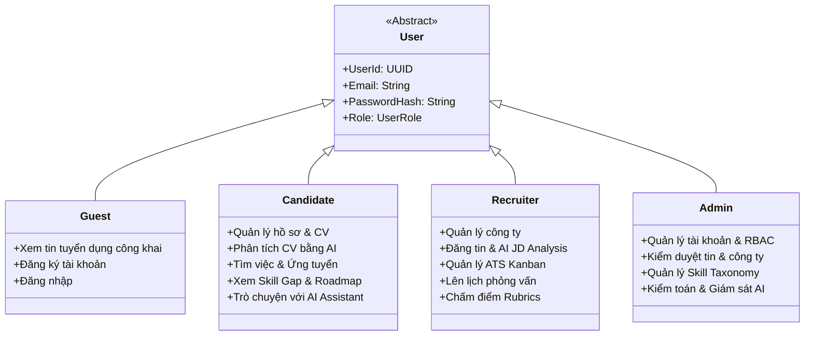

---

## 2. SƠ ĐỒ USE CASE PHÂN HỆ THEO TỪNG ROLE (ROLE-BASED USE CASE DIAGRAMS)

### 2.1. Phân hệ Ứng viên (Candidate Role Use Cases)

Ứng viên là trung tâm của chu trình định hướng và tìm kiếm cơ hội nghề nghiệp.

> **Sơ đồ Use Case phân hệ Ứng viên (Enterprise Architect Native):**  
> .png)

> **Sơ đồ Phân rã Chi tiết - Quản lý Hồ sơ & Bóc tách CV bằng AI:**  
> 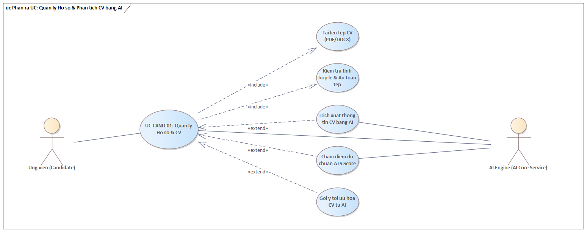

> **Sơ đồ Phân rã Chi tiết - Định hướng Nghề nghiệp & Lộ trình Skill Gap:**  
> 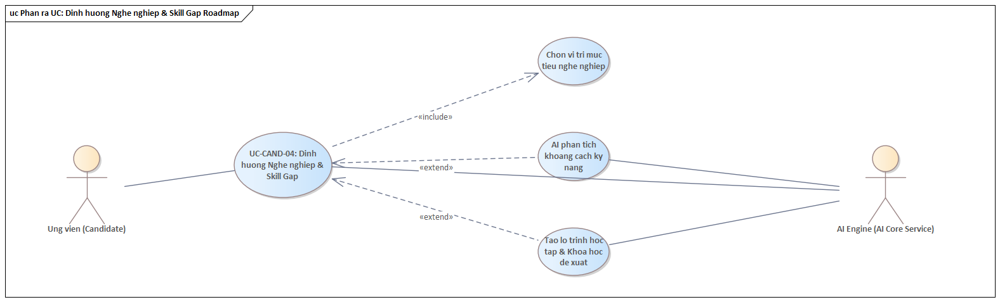

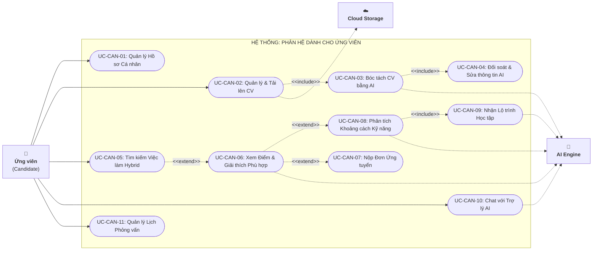

---

### 2.2. Phân hệ Nhà tuyển dụng (Recruiter / Hiring Manager Role Use Cases)

Nhà tuyển dụng quản lý toàn bộ vòng đời tin tuyển dụng và phễu sàng lọc ứng viên (ATS Pipeline).

> **Sơ đồ Use Case phân hệ Nhà tuyển dụng (Enterprise Architect Native):**  
> .png)

> **Sơ đồ Phân rã Chi tiết - Đăng tin Tuyển dụng & AI Tối ưu JD:**  
> 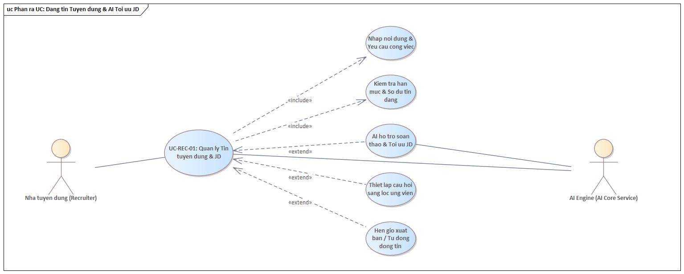

> **Sơ đồ Phân rã Chi tiết - Quản lý Tuyển dụng ATS Pipeline Kanban:**  
> 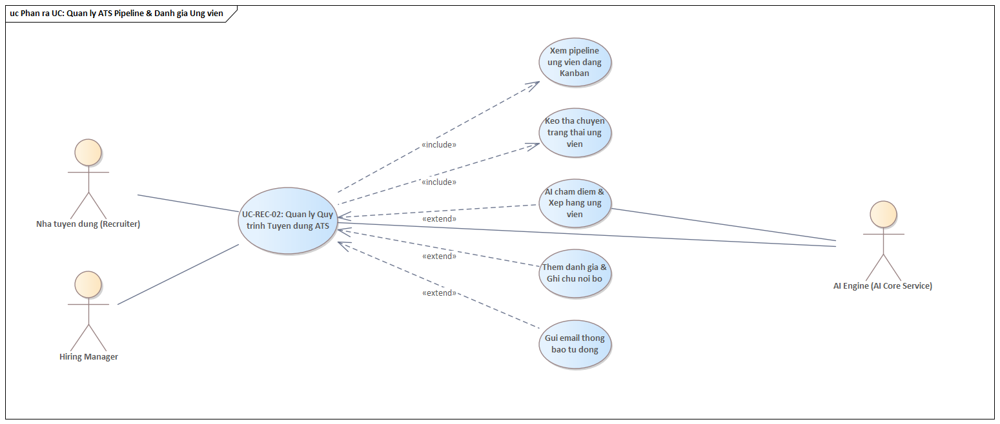

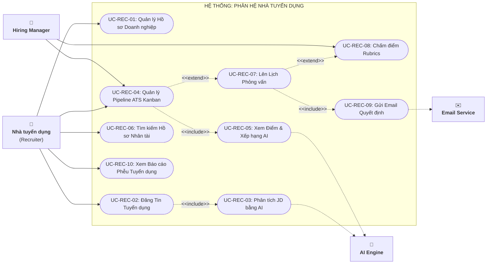

---

### 2.3. Phân hệ Quản trị viên (Administrator Role Use Cases)

Quản trị viên chịu trách nhiệm bảo đảm an toàn hệ thống, kiểm soát chất lượng dữ liệu và kiểm toán AI.

> **Sơ đồ Use Case phân hệ Quản trị viên (Enterprise Architect Native):**  
> .png)

> **Sơ đồ Phân rã Chi tiết - Kiểm duyệt Tin & Phòng chống Gian lận AI:**  
> 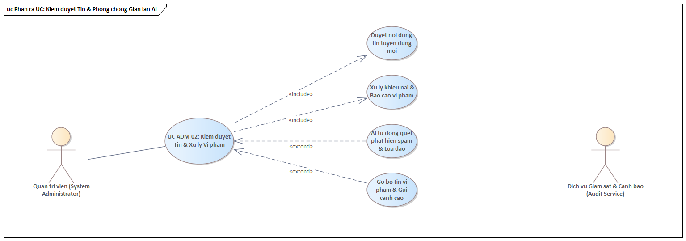

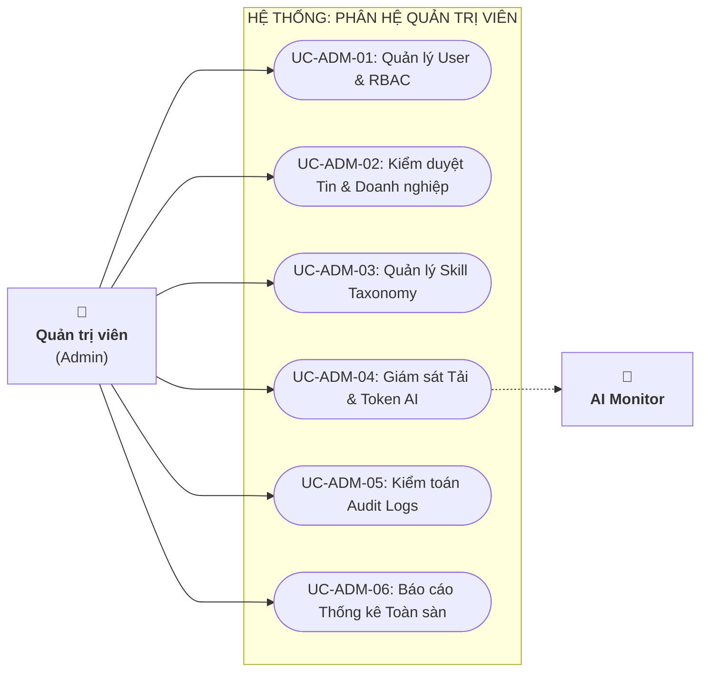

---

### 2.4. Phân hệ Người dùng Chung & Khách (Guest / Common Role Use Cases)

> **Sơ đồ Use Case phân hệ Dùng chung & Khách (Enterprise Architect Native):**  
> .png)

> **Sơ đồ Phân rã Chi tiết - Đăng nhập, Xác thực 2FA & Đặt lại Mật khẩu:**  
> 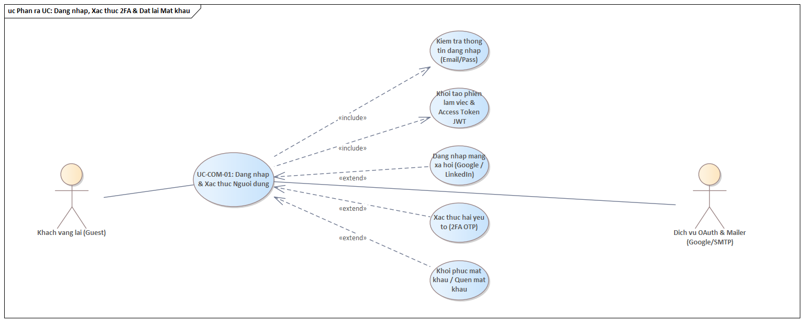

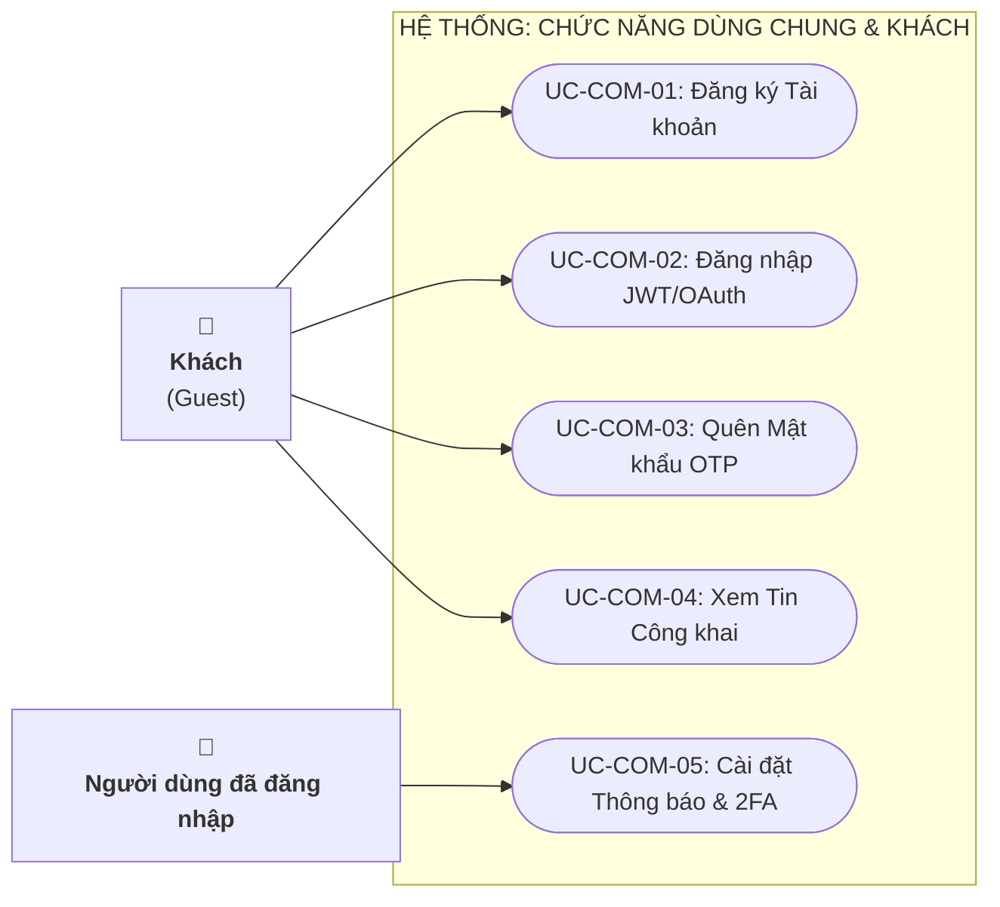

---

## 3. MA TRẬN PHÂN QUYỀN TÁC NHÂN - USE CASE (ROLE - USE CASE MATRIX)

| Mã Use Case | Tên Use Case | Khách (Guest) | Ứng viên (Candidate) | Nhà tuyển dụng (Recruiter) | Trưởng bộ phận (Hiring Mgr) | Quản trị viên (Admin) |
| :--- | :--- | :---: | :---: | :---: | :---: | :---: |
| **UC-COM-01** | Đăng ký tài khoản | ✅ | ❌ | ❌ | ❌ | ❌ |
| **UC-COM-02** | Đăng nhập hệ thống | ✅ | ❌ | ❌ | ❌ | ❌ |
| **UC-COM-04** | Xem tin tuyển dụng công khai | ✅ | ✅ | ✅ | ✅ | ✅ |
| **UC-CAN-01** | Quản lý Hồ sơ cá nhân | ❌ | ✅ | ❌ | ❌ | Xem |
| **UC-CAN-02** | Tải lên & Quản lý phiên bản CV | ❌ | ✅ | ❌ | ❌ | Xem |
| **UC-CAN-03** | Bóc tách CV bằng AI | ❌ | ✅ | ❌ | ❌ | Giám sát |
| **UC-CAN-05** | Tìm kiếm Hybrid Semantic | ✅ (Cơ bản)| ✅ (Nâng cao)| ❌ | ❌ | ❌ |
| **UC-CAN-06** | Xem điểm Matching & Giải thích | ❌ | ✅ | ✅ | ✅ | ❌ |
| **UC-CAN-07** | Nộp đơn ứng tuyển | ❌ | ✅ | ❌ | ❌ | ❌ |
| **UC-CAN-08** | Phân tích Skill Gap | ❌ | ✅ | ❌ | ❌ | ❌ |
| **UC-CAN-09** | Sinh Lộ trình Career Roadmap | ❌ | ✅ | ❌ | ❌ | ❌ |
| **UC-CAN-10** | Chat với AI Career Assistant | ❌ | ✅ | ❌ | ❌ | ❌ |
| **UC-REC-01** | Quản lý hồ sơ công ty | ❌ | ❌ | ✅ | ❌ | Phê duyệt |
| **UC-REC-02** | Tạo & Đăng tin tuyển dụng | ❌ | ❌ | ✅ | Đề xuất | Phê duyệt |
| **UC-REC-03** | AI Phân tích JD | ❌ | ❌ | ✅ | ✅ | ❌ |
| **UC-REC-04** | Quản lý ATS Kanban Pipeline | ❌ | ❌ | ✅ | ✅ (Được gán) | ❌ |
| **UC-REC-07** | Lên lịch phỏng vấn | ❌ | ❌ | ✅ | Tham gia | ❌ |
| **UC-REC-08** | Chấm điểm Rubrics phỏng vấn | ❌ | ❌ | ✅ | ✅ | ❌ |
| **UC-ADM-01** | Quản lý Người dùng & RBAC | ❌ | ❌ | ❌ | ❌ | ✅ |
| **UC-ADM-02** | Kiểm duyệt Tin & Doanh nghiệp | ❌ | ❌ | ❌ | ❌ | ✅ |
| **UC-ADM-03** | Quản lý Skill Taxonomy | ❌ | ❌ | ❌ | ❌ | ✅ |
| **UC-ADM-04** | Giám sát tải & Hạn ngạch AI | ❌ | ❌ | ❌ | ❌ | ✅ |

---

## 4. ĐẶC TẢ CHI TIẾT CÁC USE CASE TRỌNG TÂM THEO ROLE (DETAILED SPECIFICATIONS)

---

### NHÓM ROLE ỨNG VIÊN (CANDIDATE USE CASES)

#### USE CASE: UC-CAN-03 — BÓC TÁCH CV TỰ ĐỘNG BẰNG AI & ĐỐI SOÁT
- **Mã Use Case**: `UC-CAN-03`
- **Actor chính**: Ứng viên (Candidate)
- **Actor phụ**: AI Engine, Object Storage, WebSocket Service
- **Tiền điều kiện**: Ứng viên đã đăng nhập và đang ở trang Quản lý CV.
- **Kích hoạt**: Ứng viên kéo thả file CV (.pdf/.docx) vào khu vực tải lên.

##### Luồng sự kiện chính (Main Flow):
1. Ứng viên tải lên file CV (kích thước $\le 10\text{MB}$).
2. Hệ thống kiểm tra hợp lệ, tải file lên Object Storage, ghi trạng thái CV là `Processing` và trả về `JobId` cho trình duyệt.
3. Hệ thống gửi tin nhắn vào hàng đợi `cv_parsing_queue` của RabbitMQ.
4. AI Worker tiếp nhận job, trích xuất text và gọi LLM API với Schema JSON chuẩn để bóc tách:
   - Thông tin cá nhân, Học vấn, Kinh nghiệm, Dự án, Kỹ năng.
5. AI Worker ánh xạ kỹ năng trích xuất được vào `Skill Taxonomy` của hệ thống.
6. Worker cập nhật bản ghi trong cơ sở dữ liệu và gửi thông báo hoàn tất qua WebSocket.
7. Trình duyệt ứng viên tự động chuyển sang màn hình **Đối soát dữ liệu (Human-in-the-Loop Review)**:
   - Nửa bên trái: Hiển thị file PDF/DOCX gốc.
   - Nửa bên phải: Hiển thị các trường dữ liệu AI đã bóc tách được dạng form có thể chỉnh sửa.
8. Ứng viên rà soát, chỉnh sửa/bổ sung thông tin nếu AI trích xuất chưa hoàn chỉnh và nhấn "Lưu CV".
9. Hệ thống tính toán Vector Embedding của CV, lưu vào Vector DB và thông báo lưu thành công.

##### Luồng ngoại lệ (Exception Flows):
- **1a. Định dạng file không được hỗ trợ hoặc file hỏng**: Hệ thống từ chối tải lên và hiển thị thông báo lỗi.
- **4a. Lỗi kết nối API AI hoặc quá hạn (Timeout)**: Worker kích hoạt cơ chế Retry với Exponential Backoff (tối đa 3 lần). Nếu vẫn lỗi, chuyển trạng thái CV sang `Failed`, thông báo cho ứng viên để tự nhập liệu thủ công.

---

#### USE CASE: UC-CAN-08 — PHÂN TÍCH KHOẢNG CÁCH KỸ NĂNG & SINH LỘ TRÌNH PHÁT TRIỂN
- **Mã Use Case**: `UC-CAN-08`
- **Actor chính**: Ứng viên (Candidate)
- **Actor phụ**: AI Engine, Skill Taxonomy Service
- **Tiền điều kiện**: Ứng viên xem trang chi tiết công việc hoặc nhận kết quả từ chối ứng tuyển.
- **Kích hoạt**: Ứng viên nhấn nút "Phân tích khoảng cách kỹ năng & Nhận lộ trình học tập".

##### Luồng sự kiện chính (Main Flow):
1. Hệ thống lấy hồ sơ CV hiện tại của ứng viên và yêu cầu JD của công việc mục tiêu.
2. Hệ thống thực hiện đối chiếu ma trận kỹ năng giữa CV và JD:
   - Xác định danh sách kỹ năng **Missing (Thiếu hoàn toàn)** và **Need Improvement (Mức độ chưa đủ sâu)**.
3. Hệ thống gửi ngữ cảnh kỹ năng thiếu sang AI Engine yêu cầu sinh Lộ trình phát triển năng lực cá nhân hóa (Learning Roadmap).
4. AI Engine tính toán và trả về lộ trình học tập có cấu trúc 3 giai đoạn:
   - **Giai đoạn 1 (Nền tảng cấp bách - 4 tuần)**: Học kiến thức trọng tâm của các công nghệ bắt buộc.
   - **Giai đoạn 2 (Xây dựng đồ án thực chiến - 4 tuần)**: Gợi ý 1 đề tài đồ án mẫu tích hợp công nghệ mới học để chứng minh năng lực.
   - **Giai đoạn 3 (Luyện phỏng vấn & Hoàn thiện CV - 2 tuần)**: Bộ câu hỏi phỏng vấn thường gặp cho các kỹ năng đó.
5. Với mỗi kỹ năng, hệ thống gợi ý từ khóa khóa học trực tuyến uy tín (Coursera, Udemy, YouTube, Official Docs).
6. Hệ thống hiển thị giao diện Roadmap trực quan dạng mốc thời gian (Timeline).
7. Ứng viên có thể nhấn "Lưu vào Kế hoạch học tập cá nhân" để theo dõi tiến độ hoàn thành từng mục.

---

#### USE CASE: UC-CAN-10 — HỘI THOẠI CÙNG TRỢ LÝ NGHỀ NGHIỆP AI
- **Mã Use Case**: `UC-CAN-10`
- **Actor chính**: Ứng viên (Candidate)
- **Actor phụ**: AI Conversational Engine
- **Tiền điều kiện**: Ứng viên đã có CV được phân tích trên hệ thống.
- **Kích hoạt**: Ứng viên mở widget chat "AI Career Assistant" ở góc màn hình.

##### Luồng sự kiện chính (Main Flow):
1. Ứng viên gửi câu hỏi hội thoại (Ví dụ: *"Với kinh nghiệm làm đồ án .NET hiện tại, tôi nên bổ sung kỹ năng gì để ứng tuyển vị trí Fresher lương 10-12 triệu?"*).
2. Hệ thống nạp hồ sơ CV của ứng viên vào System Context kèm các thông tin thị trường việc làm hiện tại.
3. AI Engine phân tích và đưa ra câu trả lời được cá nhân hóa:
   - Đánh giá điểm mạnh/điểm yếu của hồ sơ.
   - Gợi ý 2 công nghệ bổ trợ có giá trị cao nhất (ví dụ: Docker + Redis).
   - Đề xuất cách viết lại phần "Dự án thực hiện" trong CV theo công thức đo lường kết quả STAR/XYZ.
4. Ứng viên tiếp tục trao đổi sâu hơn hoặc lưu các lời khuyên hữu ích về tài khoản.

---

### NHÓM ROLE NHÀ TUYỂN DỤNG (RECRUITER USE CASES)

#### USE CASE: UC-REC-02 — TẠO TIN TUYỂN DỤNG & AI PHÂN TÍCH JD
- **Mã Use Case**: `UC-REC-02`
- **Actor chính**: Nhà tuyển dụng (Recruiter)
- **Actor phụ**: AI Engine, Vector DB
- **Tiền điều kiện**: Doanh nghiệp đã được Admin xác thực.
- **Kích hoạt**: Recruiter nhấn "Tạo tin tuyển dụng mới".

##### Luồng sự kiện chính (Main Flow):
1. Recruiter nhập thông tin cơ bản: Chức danh, địa điểm, mức lương, số lượng cần tuyển, hạn nộp.
2. Recruiter nhập hoặc dán nội dung mô tả công việc (JD) vào khung soạn thảo.
3. Recruiter nhấn nút "Phân tích JD bằng AI".
4. AI Engine phân tích ngữ nghĩa của văn bản JD và tự động trích xuất:
   - Nhóm kỹ năng bắt buộc (Must-have skills) kèm trọng số.
   - Nhóm kỹ năng ưu tiên (Nice-to-have skills).
   - Số năm kinh nghiệm tối thiểu, cấp bậc tương ứng.
5. Hệ thống hiển thị các thẻ Tags kỹ năng đã trích xuất, cho phép Recruiter thêm, xóa hoặc điều chỉnh trọng số.
6. Recruiter nhấn "Xuất bản tin tuyển dụng".
7. Backend lưu tin tuyển dụng, đồng thời sinh Vector Embedding cho JD và lưu vào Vector DB để phục vụ tìm kiếm ngữ nghĩa.

---

#### USE CASE: UC-REC-04 — QUẢN LÝ ĐƯỜNG ỐNG TUYỂN DỤNG ATS KANBAN & XẾP HẠNG AI
- **Mã Use Case**: `UC-REC-04`
- **Actor chính**: Nhà tuyển dụng (Recruiter), Hiring Manager
- **Actor phụ**: Email/Notification Service
- **Tiền điều kiện**: Tin tuyển dụng đã có ứng viên nộp hồ sơ.
- **Kích hoạt**: Recruiter mở tab "Quản lý Ứng viên (ATS Pipeline)" của tin tuyển dụng.

##### Luồng sự kiện chính (Main Flow):
1. Hệ thống hiển thị bảng Kanban với các cột trạng thái chuẩn:
   - `Applied (Mới nộp)` -> `Screening (Phù hợp)` -> `Interview (Phỏng vấn)` -> `Offered (Đề nghị)` -> `Hired (Đã tuyển)` -> `Rejected (Từ chối)`.
2. Trên mỗi thẻ ứng viên hiển thị: Ảnh đại diện, họ tên, vị trí ứng tuyển, và **Điểm AI Match Score (kèm huy hiệu màu Xanh/Vàng/Đỏ)**.
3. Recruiter có thể lọc hoặc sắp xếp ứng viên trong cột `Applied` theo điểm số AI Match Score từ cao xuống thấp.
4. Recruiter nhấn vào thẻ ứng viên để xem Báo cáo phân tích đối soát:
   - Xem lý do AI chấm điểm (Khớp kỹ năng nào, thiếu kỹ năng nào, kinh nghiệm dự án ra sao).
5. Recruiter thực hiện kéo thẻ ứng viên sang cột `Interview`.
6. Hệ thống hiển thị Modal "Xếp lịch phỏng vấn", tự động điền thông tin và cho phép gửi email mời ứng viên.
7. Recruiter xác nhận, hệ thống lưu trạng thái mới và gửi email tự động cho ứng viên.

---

### NHÓM ROLE QUẢN TRỊ VIÊN (ADMIN USE CASES)

#### USE CASE: UC-ADM-04 — GIÁM SÁT HỆ THỐNG & KIỂM TOÁN AI (AI AUDIT & MONITORING)
- **Mã Use Case**: `UC-ADM-04`
- **Actor chính**: Quản trị viên hệ thống (Admin & AI Auditor)
- **Actor phụ**: System Monitoring Engine
- **Tiền điều kiện**: Đăng nhập với quyền Admin.
- **Kích hoạt**: Admin truy cập phân hệ "AI Analytics & Audit".

##### Luồng sự kiện chính (Main Flow):
---

## 5. CÁC SƠ ĐỒ PHÂN RÃ USE CASE CHI TIẾT TỪNG TÍNH NĂNG (DETAILED FEATURE BREAKDOWN DIAGRAMS)

Các sơ đồ dưới đây được thiết kế theo đúng chuẩn phân rã chi tiết của Enterprise Architect (EA): Actor ở bên trái, Use Case trung tâm nối tới các Sub-usecase hình tròn/bầu dục tỏa tia ra bên phải bằng các quan hệ `«include»` và `«extend»`.

### 5.1. Sơ đồ Phân rã: Xác thực & Đăng nhập (Login & Authentication Use Case)
> 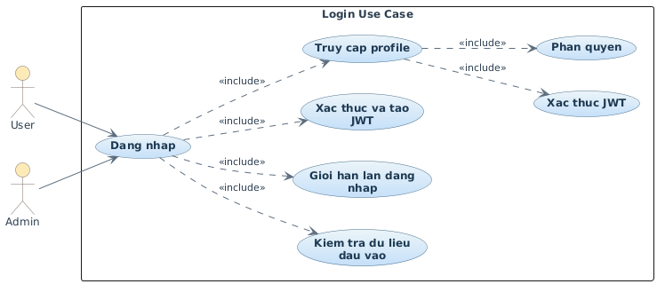

### 5.2. Sơ đồ Phân rã: Quản lý & Bóc tách CV bằng AI (CV Management & AI Parsing Use Case)
> 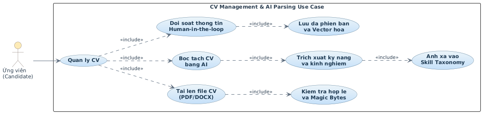

### 5.3. Sơ đồ Phân rã: Khớp nối & Chấm điểm Phù hợp AI (Candidate-Job Matching & Explainable AI)
> 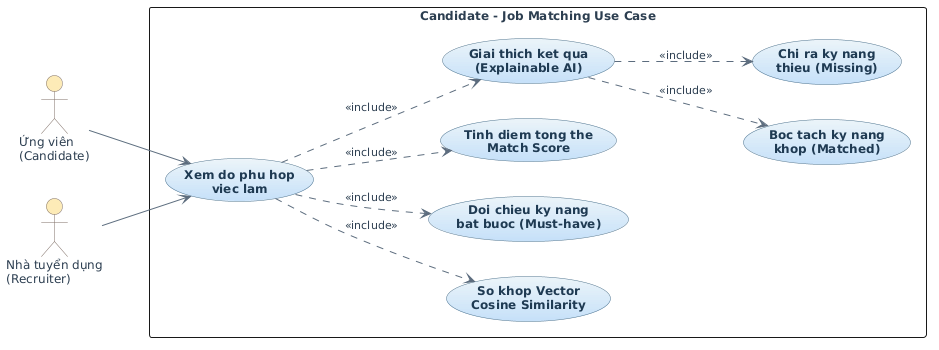

### 5.4. Sơ đồ Phân rã: Khoảng cách Kỹ năng & Lộ trình Học tập (Skill Gap Analysis & Career Roadmap)
> 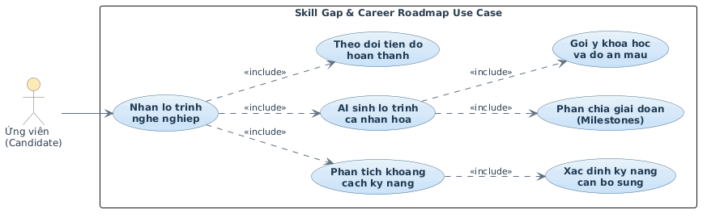

### 5.5. Sơ đồ Phân rã: Đăng tin Tuyển dụng & Phân tích JD bằng AI (Job Posting & AI JD Analysis)
> 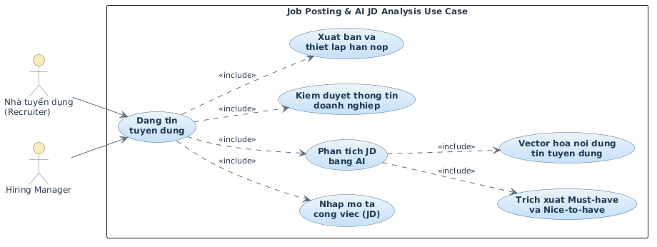

### 5.6. Sơ đồ Phân rã: Quản lý Pipeline ATS Kanban & Phỏng vấn (ATS Pipeline & Interview Management)
> 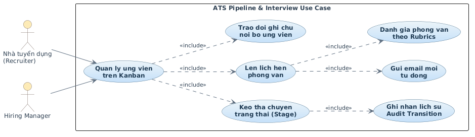

