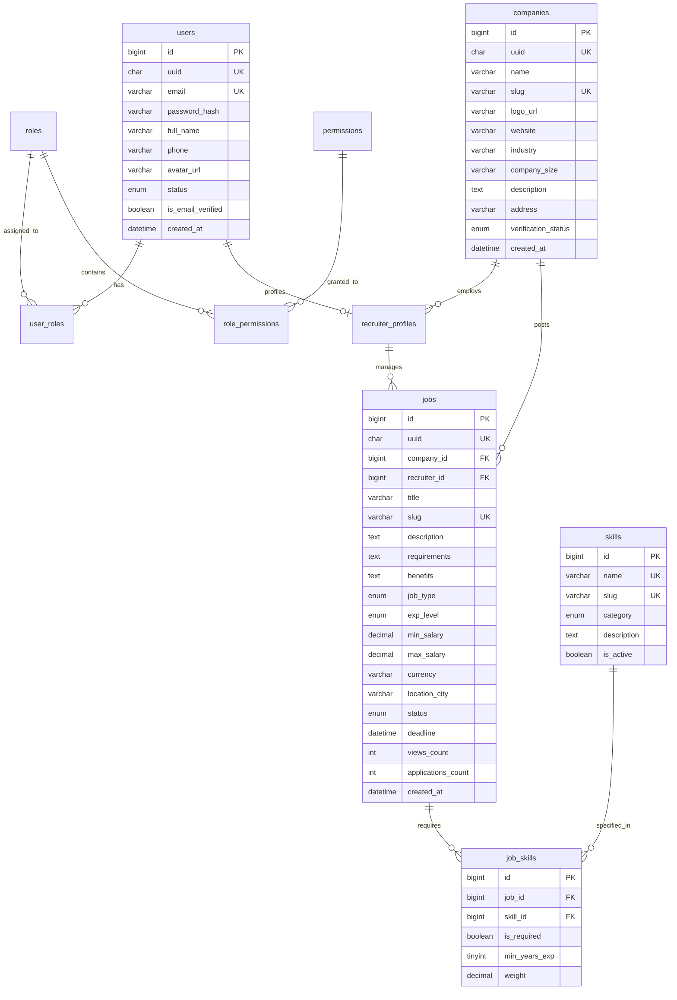
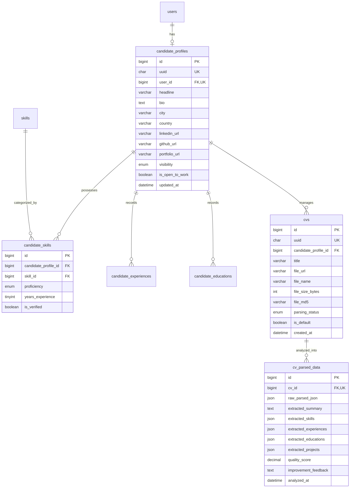
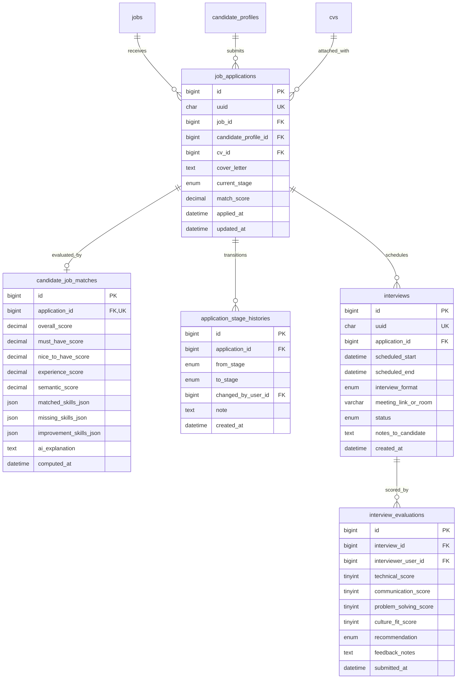
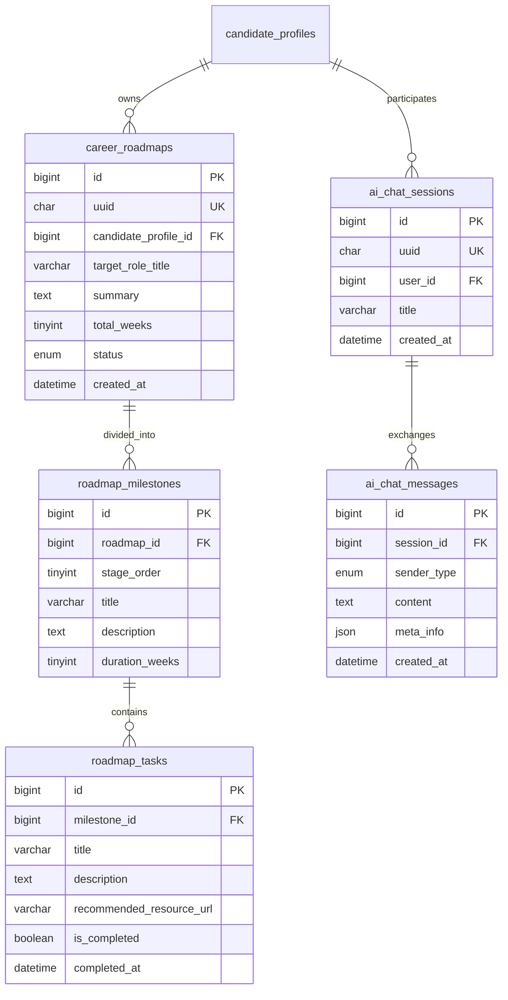

# TÀI LIỆU 01 — GIAI ĐOẠN 2: THIẾT KẾ CƠ SỞ DỮ LIỆU CHUẨN DOANH NGHIỆP (MYSQL 8.0+)
# (ENTERPRISE DATABASE ARCHITECTURE & DATA DICTIONARY SPECIFICATION)

---

## 1. NGUYÊN TẮC THIẾT KẾ HỆ THỐNG CƠ SỞ DỮ LIỆU (DATABASE DESIGN PRINCIPLES)

Để đảm bảo hệ thống phục vụ quy mô lớn (**100.000+ ứng viên, 10.000+ tin tuyển dụng, hàng triệu lượt matching**), không gặp phải **nợ kỹ thuật** khi dữ liệu phình to, cơ sở dữ liệu MySQL được thiết kế dựa trên các nguyên tắc bất biến sau:

### 1.1. Chuẩn hóa và Chiến lược Phi chuẩn hóa có kiểm soát (Normalization & Denormalization)
- **Chuẩn hóa 3NF (Third Normal Form)**: Áp dụng nghiêm ngặt cho toàn bộ các bảng giao dịch tài chính, trạng thái tuyển dụng, tài khoản, phân quyền, hồ sơ ứng viên để loại bỏ hoàn toàn dư thừa dữ liệu (Data Redundancy) và dị thường cập nhật (Update Anomaly).
- **Phi chuẩn hóa có kiểm soát (Controlled Denormalization)**: Chỉ áp dụng đối với các trường tổng hợp có tần suất đọc cực cao (ví dụ: `views_count`, `applications_count` trong bảng `jobs`, hoặc cache điểm số `match_score` trong bảng `job_applications`), được đồng bộ thông qua Transaction hoặc Event-driven Worker.

### 1.2. Chiến lược Định danh Khóa chính (Primary Key Architecture: Dual-Key Pattern)
Tránh sai lầm kinh điển của các dự án lớn:
- **Khóa chính nội bộ (Internal Clustered PK)**: Sử dụng `BIGINT UNSIGNED AUTO_INCREMENT`. Đây là lựa chọn tối ưu tuyệt đối cho MySQL InnoDB vì dữ liệu được sắp xếp tuần tự theo B+Tree, loại bỏ 100% hiện tượng phân mảnh trang (Page Splitting) và giúp Foreign Key Join có tốc độ nhanh nhất.
- **Khóa định danh công khai (Public UUID / External Key)**: Mỗi bảng chính đều có thêm cột `uuid CHAR(36)` hoặc `BINARY(16)` (UUIDv7) có đánh `UNIQUE INDEX`. Toàn bộ API public ra Frontend/Mobile chỉ dùng `uuid` này để giao tiếp. Tuyệt đối **không bao giờ để lộ ID tự tăng** ra ngoài URL để phòng chống tấn công duyệt ID (Insecure Direct Object References - IDOR).

### 1.3. Bảng mã và Định dạng Thời gian (Charset & Collation)
- **Bảng mã**: Bắt buộc sử dụng `utf8mb4` kết hợp Collation `utf8mb4_0900_ai_ci` (chuẩn MySQL 8.0+):
  - Hỗ trợ lưu trữ tiếng Việt đầy đủ dấu mà không bị lỗi font.
  - Hỗ trợ ký tự Emoji (thường xuất hiện trong CV và mô tả công việc hiện đại).
  - Tối ưu tốc độ so khớp và sắp xếp không phân biệt hoa thường.
- **Thời gian**: Toàn bộ mốc thời gian lưu trữ kiểu `DATETIME(3)` hoặc `TIMESTAMP` theo múi giờ UTC chuẩn, kèm cơ chế tự động ghi nhận `created_at` và `updated_at`.

### 1.4. Chiến lược Tìm kiếm Tiếng Việt & Hybrid Matching
- Bảng tin tuyển dụng (`jobs`) và kỹ năng (`skills`) được cấu hình **FULLTEXT INDEX với N-Gram Parser** (`ngram_token_size = 2`), cho phép tìm kiếm từ khóa tiếng Việt không dấu/có dấu mượt mà ngay trên MySQL mà không bắt buộc phải dựng Elasticsearch trong giai đoạn đầu.
- Dữ liệu kết quả AI (phân tích CV, JSON schema, cây lộ trình) được lưu trữ tại các cột kiểu `JSON` có cơ chế Validation và lập chỉ mục hàm (Functional Indexes).

---

## 2. SƠ ĐỒ THỰC THỂ LIÊN KẾT TỔNG THỂ (MERMAID ERD BY DOMAIN)

### 2.1. Phân hệ Định danh, Doanh nghiệp & Tuyển dụng (Identity, Company & Jobs)

---

### 2.2. Phân hệ Hồ sơ Ứng viên, CV & Trí tuệ AI (Candidate, CV & AI Parsing)

---

### 2.3. Phân hệ Khớp nối, Ứng tuyển & Đường ống ATS (Matching, ATS Pipeline & Interviews)

---

### 2.4. Phân hệ Lộ trình Nghề nghiệp & Trợ lý AI (Skill Gap, Roadmap & AI Bot)

---

## 3. TỪ ĐIỂN DỮ LIỆU CHI TIẾT (COMPREHENSIVE DATA DICTIONARY)

### NHÓM 1: QUẢN TRỊ TÀI KHOẢN, PHÂN QUYỀN & DOANH NGHIỆP

#### 1. Bảng `users` (Tài khoản người dùng toàn hệ thống)
*Mục đích*: Lưu trữ thông tin đăng nhập, trạng thái bảo mật của tất cả người dùng (Ứng viên, Recruiter, Admin).

| Tên cột | Kiểu dữ liệu | Nullable | Mặc định | Ý nghĩa & Ràng buộc nghiệp vụ |
| :--- | :--- | :---: | :---: | :--- |
| `id` | `BIGINT UNSIGNED` | NO | AUTO_INCREMENT | Khóa chính nội bộ (Clustered Key) |
| `uuid` | `CHAR(36)` | NO | *(UUID)* | Khóa định danh công khai (Public API / URL). `UNIQUE INDEX` |
| `email` | `VARCHAR(191)` | NO | | Email đăng nhập. `UNIQUE INDEX` (giới hạn 191 ký tự tối ưu index utf8mb4) |
| `password_hash` | `VARCHAR(255)` | NO | | Mật khẩu băm (BCrypt / Argon2id) |
| `full_name` | `VARCHAR(100)` | NO | | Họ và tên đầy đủ |
| `phone` | `VARCHAR(20)` | YES | NULL | Số điện thoại liên hệ |
| `avatar_url` | `VARCHAR(500)` | YES | NULL | Đường dẫn ảnh đại diện trên Cloud Storage |
| `status` | `ENUM('ACTIVE', 'PENDING_VERIFY', 'SUSPENDED', 'BANNED')` | NO | `'PENDING_VERIFY'` | Trạng thái tài khoản |
| `is_email_verified`| `BOOLEAN` | NO | `FALSE` | Trạng thái xác thực email |
| `created_at` | `DATETIME(3)` | NO | `CURRENT_TIMESTAMP(3)` | Thời điểm tạo tài khoản |
| `updated_at` | `DATETIME(3)` | NO | `CURRENT_TIMESTAMP(3)` | Thời điểm cập nhật cuối (ON UPDATE) |
| `deleted_at` | `DATETIME(3)` | YES | NULL | Soft delete: NULL là còn hiệu lực |

- **Chỉ mục (Indexes)**:
  - `PRIMARY KEY (id)`
  - `UNIQUE KEY uq_users_uuid (uuid)`
  - `UNIQUE KEY uq_users_email (email)`
  - `INDEX idx_users_status_created (status, created_at)`

---

#### 2. Bảng `roles` & `permissions` & `user_roles` (Mô hình RBAC chuẩn)
*Mục đích*: Quản lý phân quyền dựa trên vai trò nghiêm ngặt, cho phép mở rộng không giới hạn các vai trò mới.

- **Bảng `roles`**: `id`, `name` (`VARCHAR(50)` UNIQUE - ví dụ: `ROLE_CANDIDATE`, `ROLE_RECRUITER`, `ROLE_HIRING_MANAGER`, `ROLE_ADMIN`), `description`.
- **Bảng `permissions`**: `id`, `code` (`VARCHAR(100)` UNIQUE - ví dụ: `job:create`, `job:publish`, `candidate:view_full_pii`, `ats:move_stage`), `module_name`.
- **Bảng `role_permissions`**: Liên kết N-N giữa `role_id` và `permission_id`.
- **Bảng `user_roles`**: Liên kết N-N giữa `user_id` và `role_id`.

---

#### 3. Bảng `companies` (Hồ sơ Doanh nghiệp Tuyển dụng)
*Mục đích*: Lưu trữ thương hiệu tuyển dụng, địa điểm và trạng thái xác thực doanh nghiệp.

| Tên cột | Kiểu dữ liệu | Nullable | Mặc định | Ý nghĩa & Ràng buộc |
| :--- | :--- | :---: | :---: | :--- |
| `id` | `BIGINT UNSIGNED` | NO | AUTO_INCREMENT | Khóa chính nội bộ |
| `uuid` | `CHAR(36)` | NO | | Public UUID |
| `name` | `VARCHAR(200)` | NO | | Tên pháp nhân / thương hiệu công ty |
| `slug` | `VARCHAR(220)` | NO | | URL slug thân thiện SEO. `UNIQUE INDEX` |
| `logo_url` | `VARCHAR(500)` | YES | NULL | Logo doanh nghiệp |
| `banner_url` | `VARCHAR(500)` | YES | NULL | Ảnh bìa trang tuyển dụng công ty |
| `website` | `VARCHAR(255)` | YES | NULL | Website chính thức |
| `industry` | `VARCHAR(100)` | YES | NULL | Ngành nghề hoạt động chính (IT, Fintech,...) |
| `company_size` | `VARCHAR(50)` | YES | NULL | Quy mô (1-50, 50-200, 200-500, 500+) |
| `tax_code` | `VARCHAR(50)` | YES | NULL | Mã số thuế doanh nghiệp |
| `description` | `TEXT` | YES | NULL | Giới thiệu công ty, môi trường làm việc |
| `address` | `VARCHAR(300)` | YES | NULL | Trụ sở chính |
| `verification_status`| `ENUM('PENDING', 'VERIFIED', 'REJECTED')` | NO | `'PENDING'` | Trạng thái kiểm duyệt của Admin |
| `created_at` | `DATETIME(3)` | NO | `CURRENT_TIMESTAMP(3)` | Ngày tạo |
| `updated_at` | `DATETIME(3)` | NO | `CURRENT_TIMESTAMP(3)` | Ngày sửa |

---

#### 4. Bảng `recruiter_profiles` (Liên kết Recruiter và Doanh nghiệp)
*Mục đích*: Quản lý nhân viên nhân sự thuộc công ty nào, chức danh và quyền hạn quản lý tin tuyển dụng.

| Tên cột | Kiểu dữ liệu | Nullable | Mặc định | Ý nghĩa & Ràng buộc |
| :--- | :--- | :---: | :---: | :--- |
| `id` | `BIGINT UNSIGNED` | NO | AUTO_INCREMENT | Khóa chính |
| `user_id` | `BIGINT UNSIGNED` | NO | | Khóa ngoại tới `users(id)`. `UNIQUE KEY` |
| `company_id` | `BIGINT UNSIGNED` | NO | | Khóa ngoại tới `companies(id)` |
| `job_title` | `VARCHAR(100)` | YES | NULL | Vị trí công tác (Talent Acquisition Lead,...) |
| `is_company_admin`| `BOOLEAN` | NO | `FALSE` | Quyền quản trị tài khoản nội bộ công ty |
| `created_at` | `DATETIME(3)` | NO | `CURRENT_TIMESTAMP(3)` | |

---

### NHÓM 2: QUẢN TRỊ KỸ NĂNG & DANH MỤC DÙNG CHUNG (MASTER DATA)

#### 5. Bảng `skills` (Cây từ điển kỹ năng chuẩn hóa toàn hệ thống)
*Mục đích*: Tránh việc mỗi người viết một kiểu (ví dụ: `ReactJS`, `React.js`, `React JS` đều quy về một Skill chuẩn).

| Tên cột | Kiểu dữ liệu | Nullable | Mặc định | Ý nghĩa & Ràng buộc |
| :--- | :--- | :---: | :---: | :--- |
| `id` | `BIGINT UNSIGNED` | NO | AUTO_INCREMENT | Khóa chính |
| `name` | `VARCHAR(100)` | NO | | Tên kỹ năng chuẩn (ví dụ: "C#", "Docker", "React"). `UNIQUE` |
| `slug` | `VARCHAR(120)` | NO | | Slug tra cứu. `UNIQUE` |
| `category` | `ENUM('PROGRAMMING_LANGUAGE', 'FRAMEWORK', 'DATABASE', 'CLOUD_DEVOPS', 'TESTING', 'METHODOLOGY', 'SOFT_SKILL', 'OTHER')` | NO | `'OTHER'` | Phân loại kỹ năng |
| `description` | `VARCHAR(500)` | YES | NULL | Mô tả ngắn về công nghệ |
| `is_active` | `BOOLEAN` | NO | `TRUE` | Trạng thái hiển thị trong danh mục |

- **Bảng `skill_aliases` (Từ đồng nghĩa kỹ năng)**:
  - `id` (`BIGINT UNSIGNED AUTO_INCREMENT PK`)
  - `skill_id` (`BIGINT UNSIGNED FK -> skills(id) ON DELETE CASCADE`)
  - `alias_name` (`VARCHAR(100) UNIQUE INDEX` - ví dụ: "Golang" ánh xạ về "Go", "Dotnet Core" ánh xạ về ".NET Core").

---

### NHÓM 3: HỒ SƠ ỨNG VIÊN & QUẢN LÝ CV (CANDIDATE & CV)

#### 6. Bảng `candidate_profiles` (Hồ sơ ứng viên chuyên sâu)
*Mục đích*: Lưu trữ thông tin năng lực, mong muốn nghề nghiệp và quyền riêng tư của ứng viên.

| Tên cột | Kiểu dữ liệu | Nullable | Mặc định | Ý nghĩa & Ràng buộc |
| :--- | :--- | :---: | :---: | :--- |
| `id` | `BIGINT UNSIGNED` | NO | AUTO_INCREMENT | Khóa chính |
| `uuid` | `CHAR(36)` | NO | | Public UUID |
| `user_id` | `BIGINT UNSIGNED` | NO | | `FK -> users(id)` (Quan hệ 1-1: `UNIQUE KEY`) |
| `headline` | `VARCHAR(150)` | YES | NULL | Tiêu đề nghề nghiệp (ví dụ: "Junior Backend .NET Developer") |
| `bio` | `TEXT` | YES | NULL | Giới thiệu bản thân ngắn gọn |
| `city` | `VARCHAR(100)` | YES | NULL | Thành phố cư trú (Hà Nội, TP.HCM, Đà Nẵng,...) |
| `country` | `VARCHAR(50)` | NO | `'Vietnam'` | Quốc gia |
| `linkedin_url` | `VARCHAR(255)` | YES | NULL | Link LinkedIn |
| `github_url` | `VARCHAR(255)` | YES | NULL | Link GitHub cá nhân |
| `portfolio_url` | `VARCHAR(255)` | YES | NULL | Link Portfolio / Website cá nhân |
| `expected_salary_min`| `DECIMAL(12, 2)` | YES | NULL | Mức lương kỳ vọng tối thiểu |
| `expected_salary_max`| `DECIMAL(12, 2)` | YES | NULL | Mức lương kỳ vọng tối đa |
| `visibility` | `ENUM('PUBLIC', 'PRIVATE', 'ANONYMOUS')` | NO | `'PUBLIC'` | Cài đặt quyền riêng tư hồ sơ |
| `is_open_to_work` | `BOOLEAN` | NO | `TRUE` | Bật/tắt trạng thái sẵn sàng nhận việc |
| `updated_at` | `DATETIME(3)` | NO | `CURRENT_TIMESTAMP(3)` | |

---

#### 7. Bảng `cvs` (Quản lý các phiên bản CV của Ứng viên)
*Mục đích*: Cho phép ứng viên sở hữu nhiều phiên bản CV cho các vị trí công việc khác nhau (tối đa 5 bản).

| Tên cột | Kiểu dữ liệu | Nullable | Mặc định | Ý nghĩa & Ràng buộc |
| :--- | :--- | :---: | :---: | :--- |
| `id` | `BIGINT UNSIGNED` | NO | AUTO_INCREMENT | Khóa chính |
| `uuid` | `CHAR(36)` | NO | | Public UUID |
| `candidate_profile_id`| `BIGINT UNSIGNED` | NO | | `FK -> candidate_profiles(id) ON DELETE CASCADE` |
| `title` | `VARCHAR(150)` | NO | | Tên phiên bản CV (ví dụ: "CV .NET Backend 2026") |
| `file_url` | `VARCHAR(500)` | NO | | Đường dẫn lưu trữ file trên S3/MinIO |
| `file_name` | `VARCHAR(255)` | NO | | Tên file gốc người dùng tải lên |
| `file_size_bytes`| `INT UNSIGNED` | NO | | Dung lượng file (bytes) |
| `file_md5` | `CHAR(32)` | NO | | Checksum MD5 chống tải trùng lặp file rác |
| `parsing_status` | `ENUM('PENDING', 'PROCESSING', 'COMPLETED', 'FAILED')` | NO | `'PENDING'` | Trạng thái bóc tách AI |
| `is_default` | `BOOLEAN` | NO | `FALSE` | Đánh dấu CV chính dùng khi ứng tuyển nhanh |
| `created_at` | `DATETIME(3)` | NO | `CURRENT_TIMESTAMP(3)` | Ngày tải lên |
| `deleted_at` | `DATETIME(3)` | YES | NULL | Soft delete |

- **Chỉ mục**: `INDEX idx_cvs_candidate (candidate_profile_id, is_default, deleted_at)`

---

#### 8. Bảng `cv_parsed_data` (Kết quả bóc tách cấu trúc bằng AI)
*Mục đích*: Lưu trữ dữ liệu JSON đã bóc tách từ CV để phục vụ đối soát, matching và tra cứu nhanh.

| Tên cột | Kiểu dữ liệu | Nullable | Mặc định | Ý nghĩa & Ràng buộc |
| :--- | :--- | :---: | :---: | :--- |
| `id` | `BIGINT UNSIGNED` | NO | AUTO_INCREMENT | Khóa chính |
| `cv_id` | `BIGINT UNSIGNED` | NO | | `FK -> cvs(id) ON DELETE CASCADE`. `UNIQUE KEY` |
| `raw_parsed_json` | `JSON` | NO | | Toàn bộ payload JSON trả về từ LLM (Gemini) |
| `extracted_summary`| `TEXT` | YES | NULL | Tóm tắt lý lịch ngắn gọn do AI tổng hợp |
| `extracted_skills` | `JSON` | YES | NULL | Danh sách kỹ năng: `[{"name": "C#", "years": 2, "category": "LANG"}]` |
| `extracted_experiences`| `JSON`| YES | NULL | Mảng kinh nghiệm làm việc có cấu trúc |
| `extracted_educations` | `JSON` | YES | NULL | Mảng trường lớp, bằng cấp, điểm GPA |
| `extracted_projects` | `JSON` | YES | NULL | Mảng dự án, công nghệ sử dụng, vai trò |
| `quality_score` | `DECIMAL(4, 1)` | YES | NULL | Điểm chất lượng trình bày CV (thang 100) |
| `improvement_feedback`| `TEXT`| YES | NULL | Lời khuyên của AI về cách tối ưu CV |
| `analyzed_at` | `DATETIME(3)` | NO | `CURRENT_TIMESTAMP(3)` | Thời điểm phân tích xong |

---

### NHÓM 4: TIN TUYỂN DỤNG & YÊU CẦU CÔNG NGHỆ (JOB MANAGEMENT)

#### 9. Bảng `jobs` (Tin tuyển dụng)
*Mục đích*: Quản lý vòng đời tin tuyển dụng, tiêu chuẩn vị trí, mức lương và thống kê lượt tiếp cận.

| Tên cột | Kiểu dữ liệu | Nullable | Mặc định | Ý nghĩa & Ràng buộc |
| :--- | :--- | :---: | :---: | :--- |
| `id` | `BIGINT UNSIGNED` | NO | AUTO_INCREMENT | Khóa chính |
| `uuid` | `CHAR(36)` | NO | | Public UUID |
| `company_id` | `BIGINT UNSIGNED` | NO | | `FK -> companies(id)` |
| `recruiter_id` | `BIGINT UNSIGNED` | NO | | `FK -> recruiter_profiles(id)` |
| `title` | `VARCHAR(200)` | NO | | Chức danh tuyển dụng (ví dụ: "Fresher .NET Backend") |
| `slug` | `VARCHAR(250)` | NO | | Slug URL SEO. `UNIQUE KEY` |
| `description` | `LONGTEXT` | NO | | Mô tả công việc chi tiết |
| `requirements` | `LONGTEXT` | NO | | Yêu cầu chuyên môn, kỹ năng |
| `benefits` | `LONGTEXT` | YES | NULL | Quyền lợi, chế độ đãi ngộ |
| `job_type` | `ENUM('FULL_TIME', 'PART_TIME', 'INTERNSHIP', 'CONTRACT', 'REMOTE', 'HYBRID')` | NO | `'FULL_TIME'` | Hình thức làm việc |
| `exp_level` | `ENUM('INTERN', 'FRESHER', 'JUNIOR', 'MIDDLE', 'SENIOR', 'LEAD')` | NO | `'FRESHER'` | Cấp bậc ứng viên |
| `min_salary` | `DECIMAL(12, 2)` | YES | NULL | Mức lương tối thiểu (triệu VNĐ hoặc USD) |
| `max_salary` | `DECIMAL(12, 2)` | YES | NULL | Mức lương tối đa |
| `currency` | `VARCHAR(10)` | NO | `'VND'` | Đơn vị tiền tệ |
| `is_salary_negotiable`| `BOOLEAN` | NO | `FALSE` | Lương thỏa thuận |
| `location_city` | `VARCHAR(100)` | NO | | Thành phố làm việc chính |
| `location_address` | `VARCHAR(300)` | YES | NULL | Địa chỉ chi tiết nơi làm việc |
| `status` | `ENUM('DRAFT', 'PENDING_APPROVAL', 'PUBLISHED', 'PAUSED', 'CLOSED', 'EXPIRED')` | NO | `'DRAFT'` | Trạng thái tin |
| `deadline` | `DATETIME` | YES | NULL | Hạn chót nhận hồ sơ |
| `views_count` | `INT UNSIGNED` | NO | `0` | Số lượt xem tin |
| `applications_count`| `INT UNSIGNED` | NO | `0` | Số lượng CV đã nộp |
| `published_at` | `DATETIME(3)` | YES | NULL | Thời điểm xuất bản công khai |
| `created_at` | `DATETIME(3)` | NO | `CURRENT_TIMESTAMP(3)` | |
| `updated_at` | `DATETIME(3)` | NO | `CURRENT_TIMESTAMP(3)` | |
| `deleted_at` | `DATETIME(3)` | YES | NULL | Soft delete |

- **Chỉ mục**:
  - `INDEX idx_jobs_filter (status, exp_level, location_city, published_at DESC)`
  - `FULLTEXT INDEX ft_jobs_search (title, description, requirements) WITH PARSER ngram`

---

#### 10. Bảng `job_skills` (Kỹ năng yêu cầu của tin tuyển dụng)
*Mục đích*: Lưu trữ các kỹ năng do AI hoặc Recruiter gắn nhãn, phân rõ bắt buộc vs ưu tiên để phục vụ thuật toán matching.

| Tên cột | Kiểu dữ liệu | Nullable | Mặc định | Ý nghĩa & Ràng buộc |
| :--- | :--- | :---: | :---: | :--- |
| `id` | `BIGINT UNSIGNED` | NO | AUTO_INCREMENT | Khóa chính |
| `job_id` | `BIGINT UNSIGNED` | NO | | `FK -> jobs(id) ON DELETE CASCADE` |
| `skill_id` | `BIGINT UNSIGNED` | NO | | `FK -> skills(id)` |
| `is_required` | `BOOLEAN` | NO | `TRUE` | `TRUE`: Kỹ năng bắt buộc (Must-have); `FALSE`: Ưu tiên (Nice-to-have) |
| `min_years_exp` | `TINYINT UNSIGNED` | NO | `0` | Số năm kinh nghiệm tối thiểu yêu cầu cho skill này |
| `weight` | `DECIMAL(3, 2)` | NO | `1.00` | Trọng số ưu tiên (từ 0.1 đến 2.0) do Recruiter tùy chỉnh |

- **Ràng buộc duy nhất**: `UNIQUE KEY uq_job_skill (job_id, skill_id)`

---

### NHÓM 5: KHỚP NỐI AI & PHÂN TÍCH KHOẢNG CÁCH KỸ NĂNG (MATCHING & SKILL GAP)

#### 11. Bảng `candidate_job_matches` (Bảng phân tích độ phù hợp & Giải thích)
*Mục đích*: Lưu trữ chi tiết điểm số đối soát giữa CV và JD, minh bạch hóa lý do chấm điểm của AI.

| Tên cột | Kiểu dữ liệu | Nullable | Mặc định | Ý nghĩa & Ràng buộc |
| :--- | :--- | :---: | :---: | :--- |
| `id` | `BIGINT UNSIGNED` | NO | AUTO_INCREMENT | Khóa chính |
| `job_id` | `BIGINT UNSIGNED` | NO | | `FK -> jobs(id) ON DELETE CASCADE` |
| `candidate_profile_id`| `BIGINT UNSIGNED` | NO | | `FK -> candidate_profiles(id)` |
| `cv_id` | `BIGINT UNSIGNED` | NO | | `FK -> cvs(id)` |
| `overall_score` | `DECIMAL(5, 2)` | NO | | Điểm tổng thể (0.00 - 100.00) |
| `must_have_score` | `DECIMAL(5, 2)` | NO | | Điểm kỹ năng bắt buộc (Trọng số 45%) |
| `nice_to_have_score`| `DECIMAL(5, 2)` | NO | | Điểm kỹ năng ưu tiên (Trọng số 20%) |
| `experience_score` | `DECIMAL(5, 2)` | NO | | Điểm số năm & độ sâu dự án (Trọng số 25%) |
| `semantic_score` | `DECIMAL(5, 2)` | NO | | Điểm tương đồng ngữ nghĩa vector (Trọng số 10%) |
| `matched_skills_json`| `JSON` | YES | NULL | Mảng kỹ năng ứng viên đáp ứng hoàn hảo |
| `missing_skills_json`| `JSON` | YES | NULL | Mảng kỹ năng bắt buộc còn thiếu hoàn toàn |
| `improvement_skills_json`| `JSON` | YES | NULL | Mảng kỹ năng cần trau dồi thêm |
| `ai_explanation` | `TEXT` | YES | NULL | Đoạn văn giải thích khách quan lý do chấm điểm |
| `computed_at` | `DATETIME(3)` | NO | `CURRENT_TIMESTAMP(3)` | Thời điểm tính toán |

- **Chỉ mục**: `UNIQUE KEY uq_match_job_cv (job_id, cv_id)`

---

#### 12. Bảng `career_roadmaps` & `roadmap_milestones` & `roadmap_tasks` (Lộ trình học tập cá nhân hóa)
*Mục đích*: Lưu trữ lộ trình AI sinh ra khi ứng viên thiếu kỹ năng, giúp ứng viên theo dõi việc học tập.

- **Bảng `career_roadmaps`**:
  - `id` (`BIGINT UNSIGNED AUTO_INCREMENT PK`), `uuid` (`CHAR(36) UNIQUE`)
  - `candidate_profile_id` (`BIGINT UNSIGNED FK`)
  - `target_role_title` (`VARCHAR(150)` - ví dụ: "Mid-level Cloud .NET Engineer")
  - `target_job_id` (`BIGINT UNSIGNED NULLABLE FK -> jobs(id)`)
  - `summary` (`TEXT` - Mục tiêu lộ trình)
  - `total_weeks` (`TINYINT UNSIGNED` - Thời lượng dự kiến)
  - `status` (`ENUM('IN_PROGRESS', 'COMPLETED', 'ABANDONED')`)
  - `created_at` (`DATETIME(3)`)
- **Bảng `roadmap_milestones`**:
  - `id` (`BIGINT UNSIGNED PK`), `roadmap_id` (`BIGINT UNSIGNED FK`), `stage_order` (`TINYINT`), `title` (`VARCHAR(150)`), `description` (`TEXT`), `duration_weeks` (`TINYINT`).
- **Bảng `roadmap_tasks`**:
  - `id` (`BIGINT UNSIGNED PK`), `milestone_id` (`BIGINT UNSIGNED FK`), `title` (`VARCHAR(200)`), `description` (`TEXT`), `skill_id` (`BIGINT UNSIGNED NULLABLE FK`), `recommended_resource_url` (`VARCHAR(500)`), `is_completed` (`BOOLEAN DEFAULT FALSE`), `completed_at` (`DATETIME NULL`).

---

### NHÓM 6: QUY TRÌNH ỨNG TUYỂN & PIPELINE ATS KANBAN (APPLICATION TRACKING)

#### 13. Bảng `job_applications` (Đơn ứng tuyển vào công việc)
*Mục đích*: Quản lý quá trình ứng tuyển của ứng viên, đóng vai trò là "Thẻ (Card)" di chuyển trên bảng Kanban của Recruiter.

| Tên cột | Kiểu dữ liệu | Nullable | Mặc định | Ý nghĩa & Ràng buộc |
| :--- | :--- | :---: | :---: | :--- |
| `id` | `BIGINT UNSIGNED` | NO | AUTO_INCREMENT | Khóa chính |
| `uuid` | `CHAR(36)` | NO | | Public UUID |
| `job_id` | `BIGINT UNSIGNED` | NO | | `FK -> jobs(id)` |
| `candidate_profile_id`| `BIGINT UNSIGNED` | NO | | `FK -> candidate_profiles(id)` |
| `cv_id` | `BIGINT UNSIGNED` | NO | | `FK -> cvs(id)` (Bản CV cụ thể được nộp) |
| `cover_letter` | `TEXT` | YES | NULL | Thư giới thiệu của ứng viên |
| `current_stage` | `ENUM('APPLIED', 'SCREENING', 'INTERVIEW', 'OFFERED', 'HIRED', 'REJECTED')` | NO | `'APPLIED'` | Cột trạng thái hiện tại trên Kanban |
| `match_score` | `DECIMAL(5, 2)` | YES | NULL | Điểm matching sao chép nhanh để Recruiter sort trên Kanban |
| `rejection_reason` | `VARCHAR(500)` | YES | NULL | Lý do từ chối (nếu có) |
| `applied_at` | `DATETIME(3)` | NO | `CURRENT_TIMESTAMP(3)` | Ngày nộp hồ sơ |
| `updated_at` | `DATETIME(3)` | NO | `CURRENT_TIMESTAMP(3)` | Ngày chuyển trạng thái gần nhất |

- **Ràng buộc**: `UNIQUE KEY uq_candidate_job_apply (job_id, candidate_profile_id)` (Một ứng viên chỉ nộp 1 lần cho 1 tin đang mở).
- **Chỉ mục Kanban**: `INDEX idx_applications_kanban (job_id, current_stage, match_score DESC)` (Tối ưu tuyệt đối cho việc tải bảng Kanban và xếp hạng ứng viên).

---

#### 14. Bảng `application_stage_histories` (Lịch sử chuyển trạng thái tuyển dụng)
*Mục đích*: Audit log chi tiết cho từng đơn ứng tuyển (Ai chuyển từ trạng thái nào sang trạng thái nào, vào thời điểm nào, kèm ghi chú gì).

| Tên cột | Kiểu dữ liệu | Nullable | Mặc định | Ý nghĩa & Ràng buộc |
| :--- | :--- | :---: | :---: | :--- |
| `id` | `BIGINT UNSIGNED` | NO | AUTO_INCREMENT | Khóa chính |
| `application_id` | `BIGINT UNSIGNED` | NO | | `FK -> job_applications(id) ON DELETE CASCADE` |
| `from_stage` | `ENUM(...)` | YES | NULL | Trạng thái trước khi chuyển |
| `to_stage` | `ENUM(...)` | NO | | Trạng thái sau khi chuyển |
| `changed_by_user_id`| `BIGINT UNSIGNED`| NO | | `FK -> users(id)` (Recruiter/Hiring Manager thực hiện) |
| `note` | `TEXT` | YES | NULL | Ghi chú nội bộ lý do chuyển giai đoạn |
| `created_at` | `DATETIME(3)` | NO | `CURRENT_TIMESTAMP(3)` | |

---

### NHÓM 7: QUẢN LÝ PHỎNG VẤN & TIÊU CHÍ ĐÁNH GIÁ (INTERVIEW & SCORECARD)

#### 15. Bảng `interviews` (Lịch phỏng vấn)
*Mục đích*: Quản lý lịch hẹn phỏng vấn ứng viên của công ty.

| Tên cột | Kiểu dữ liệu | Nullable | Mặc định | Ý nghĩa & Ràng buộc |
| :--- | :--- | :---: | :---: | :--- |
| `id` | `BIGINT UNSIGNED` | NO | AUTO_INCREMENT | Khóa chính |
| `uuid` | `CHAR(36)` | NO | | Public UUID |
| `application_id` | `BIGINT UNSIGNED` | NO | | `FK -> job_applications(id) ON DELETE CASCADE` |
| `round_number` | `TINYINT UNSIGNED` | NO | `1` | Vòng phỏng vấn (Vòng 1: HR, Vòng 2: Technical,...) |
| `scheduled_start` | `DATETIME` | NO | | Thời gian bắt đầu |
| `scheduled_end` | `DATETIME` | NO | | Thời gian kết thúc |
| `interview_format` | `ENUM('ONLINE', 'OFFLINE')` | NO | `'ONLINE'` | Hình thức phỏng vấn |
| `meeting_link_or_room`| `VARCHAR(500)`| YES | NULL | Link Google Meet/Teams hoặc phòng họp |
| `status` | `ENUM('SCHEDULED', 'COMPLETED', 'CANCELLED', 'RESCHEDULED')` | NO | `'SCHEDULED'` | Trạng thái buổi phỏng vấn |
| `notes_to_candidate`| `TEXT` | YES | NULL | Lời nhắn gửi ứng viên trong thư mời |
| `created_at` | `DATETIME(3)` | NO | `CURRENT_TIMESTAMP(3)` | |

---

#### 16. Bảng `interview_evaluations` (Phiếu chấm điểm Rubrics của Interviewer)
*Mục đích*: Chuẩn hóa việc chấm điểm phỏng vấn, tránh đánh giá theo cảm tính cá nhân.

| Tên cột | Kiểu dữ liệu | Nullable | Mặc định | Ý nghĩa & Ràng buộc |
| :--- | :--- | :---: | :---: | :--- |
| `id` | `BIGINT UNSIGNED` | NO | AUTO_INCREMENT | Khóa chính |
| `interview_id` | `BIGINT UNSIGNED` | NO | | `FK -> interviews(id) ON DELETE CASCADE` |
| `interviewer_user_id`| `BIGINT UNSIGNED`| NO | | `FK -> users(id)` (Người chấm) |
| `technical_score` | `TINYINT UNSIGNED` | NO | | Thang điểm 1-5 (Kỹ năng chuyên môn) |
| `communication_score`| `TINYINT UNSIGNED`| NO | | Thang điểm 1-5 (Giao tiếp & Ứng xử) |
| `problem_solving_score`| `TINYINT UNSIGNED`| NO | | Thang điểm 1-5 (Tư duy giải quyết vấn đề) |
| `culture_fit_score`| `TINYINT UNSIGNED`| NO | | Thang điểm 1-5 (Phù hợp văn hóa công ty) |
| `recommendation` | `ENUM('STRONG_HIRE', 'HIRE', 'NEUTRAL', 'NO_HIRE', 'STRONG_NO_HIRE')` | NO | `'NEUTRAL'` | Kết luận cuối cùng |
| `feedback_notes` | `TEXT` | YES | NULL | Nhận xét chi tiết điểm mạnh, điểm yếu |
| `submitted_at` | `DATETIME(3)` | NO | `CURRENT_TIMESTAMP(3)` | Thời điểm nộp đánh giá |

- **Ràng buộc**: `UNIQUE KEY uq_interview_evaluator (interview_id, interviewer_user_id)`

---

### NHÓM 8: TRỢ LÝ AI, THÔNG BÁO & AUDIT LOGS

#### 17. Bảng `ai_chat_sessions` & `ai_chat_messages` (Trợ lý Nghề nghiệp AI)
*Mục đích*: Lưu vết các phiên hội thoại tư vấn hướng nghiệp giữa ứng viên và AI Career Assistant.

- **Bảng `ai_chat_sessions`**: `id`, `uuid`, `user_id` (`FK -> users(id)`), `title` (`VARCHAR(200)`), `created_at`, `updated_at`.
- **Bảng `ai_chat_messages`**: `id`, `session_id` (`FK -> ai_chat_sessions(id) ON DELETE CASCADE`), `sender_type` (`ENUM('USER', 'ASSISTANT', 'SYSTEM')`), `content` (`LONGTEXT`), `meta_info` (`JSON` - chứa tokens consumed, model name), `created_at`.

#### 18. Bảng `notifications` (Hệ thống Thông báo Thời gian thực)
*Mục đích*: Lưu các thông báo in-app cho người dùng khi có sự kiện tuyển dụng, matching hoặc phỏng vấn.

| Tên cột | Kiểu dữ liệu | Nullable | Mặc định | Ý nghĩa & Ràng buộc |
| :--- | :--- | :---: | :---: | :--- |
| `id` | `BIGINT UNSIGNED` | NO | AUTO_INCREMENT | Khóa chính |
| `user_id` | `BIGINT UNSIGNED` | NO | | `FK -> users(id) ON DELETE CASCADE` |
| `type` | `VARCHAR(50)` | NO | | Loại thông báo (`JOB_MATCH`, `INTERVIEW_INVITE`,...) |
| `title` | `VARCHAR(200)` | NO | | Tiêu đề thông báo |
| `content` | `TEXT` | NO | | Nội dung chi tiết |
| `reference_type` | `VARCHAR(50)` | YES | NULL | Bảng tham chiếu (`job_applications`, `jobs`,...) |
| `reference_id` | `BIGINT UNSIGNED` | YES | NULL | ID của bản ghi tham chiếu |
| `is_read` | `BOOLEAN` | NO | `FALSE` | Trạng thái đã đọc |
| `read_at` | `DATETIME(3)` | YES | NULL | Thời điểm đọc |
| `created_at` | `DATETIME(3)` | NO | `CURRENT_TIMESTAMP(3)` | Thời điểm phát sinh thông báo |

- **Chỉ mục**: `INDEX idx_user_unread_notif (user_id, is_read, created_at DESC)`

#### 19. Bảng `audit_logs` (Nhật ký Kiểm toán Hệ thống & Bảo mật)
*Mục đích*: Phục vụ bảo mật, truy vết vi phạm và tuân thủ Nghị định 13/2023/NĐ-CP về bảo vệ dữ liệu cá nhân.

| Tên cột | Kiểu dữ liệu | Nullable | Mặc định | Ý nghĩa & Ràng buộc |
| :--- | :--- | :---: | :---: | :--- |
| `id` | `BIGINT UNSIGNED` | NO | AUTO_INCREMENT | Khóa chính |
| `user_id` | `BIGINT UNSIGNED` | YES | NULL | Người thực hiện hành động (NULL nếu là system worker) |
| `action` | `VARCHAR(100)` | NO | | Hành động (`USER_LOGIN`, `DELETE_CV`, `CHANGE_STAGE`,...) |
| `entity_name` | `VARCHAR(100)` | NO | | Tên bảng bị tác động (`cvs`, `job_applications`,...) |
| `entity_id` | `BIGINT UNSIGNED` | NO | | ID bản ghi bị tác động |
| `old_values` | `JSON` | YES | NULL | Dữ liệu cũ trước khi sửa đổi |
| `new_values` | `JSON` | YES | NULL | Dữ liệu mới sau khi sửa đổi |
| `ip_address` | `VARCHAR(45)` | YES | NULL | Địa chỉ IP (hỗ trợ IPv4 & IPv6) |
| `user_agent` | `VARCHAR(255)` | YES | NULL | Trình duyệt / Thiết bị |
| `correlation_id`| `VARCHAR(64)` | YES | NULL | Mã truy vết phân tán xuyên suốt hệ thống |
| `created_at` | `DATETIME(3)` | NO | `CURRENT_TIMESTAMP(3)` | |

---

## 4. CHIẾN LƯỢC BẢO VỆ HIỆU NĂNG CHO QUY MÔ LỚN (PERFORMANCE OPTIMIZATION STRATEGY)

1. **Phân vùng dữ liệu (Table Partitioning Readiness)**:
   - Các bảng có dung lượng tăng trưởng nhanh chóng như `audit_logs`, `notifications`, `application_stage_histories` được thiết kế sẵn cấu trúc thời gian để có thể áp dụng `PARTITION BY RANGE (TO_DAYS(created_at))` theo từng tháng hoặc quý khi dữ liệu vượt quá 10 triệu dòng.
2. **Ngăn ngừa hiện tượng N+1 Query**:
   - Mọi khóa ngoại đều có chỉ mục (`INDEX`) tương ứng.
   - Các trường đếm (`applications_count`, `views_count`) được lưu trực tiếp trên bảng cha `jobs` và cập nhật thông qua atomic operation (`UPDATE jobs SET applications_count = applications_count + 1 WHERE id = ?`), giúp trang danh sách việc làm không bao giờ phải chạy lệnh `COUNT(*)` lặp lại trên hàng trăm ngàn đơn ứng tuyển.
3. **Quản lý Vòng đời Dữ liệu AI (AI Lifecycle Management)**:
   - File CV gốc và ảnh đại diện được lưu ở Object Storage (MinIO/S3), cơ sở dữ liệu MySQL chỉ lưu đường dẫn URL và mã MD5 checksum, giữ cho dung lượng database gọn gàng, thời gian sao lưu (Backup) và phục hồi (Restore) diễn ra trong vài phút.
