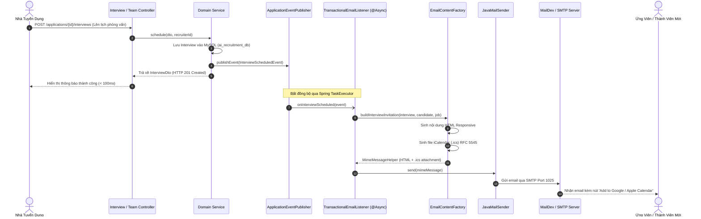

# Hệ Thống Email Giao Dịch & Tích Hợp Lịch (.ics) - TalentBridge

## 1. Tổng Quan Kiến Trúc
Hệ thống Email Giao dịch (Transactional Email) của **TalentBridge** được thiết kế theo mô hình **Event-Driven Architecture** (Kiến trúc hướng sự kiện) kết hợp với **Asynchronous Processing** (`@Async`) trong Spring Boot. Kiến trúc này tách biệt hoàn toàn luồng xử lý nghiệp vụ chính (HTTP request/response) khỏi luồng gửi thư SMTP, đảm bảo thời gian phản hồi cho người dùng dưới 200ms ngay cả khi máy chủ SMTP có độ trễ cao.

Trong môi trường phát triển và kiểm thử tự động, nền tảng sử dụng **MailDev v3** (SMTP server chạy trên port `1025`, giao diện Web/REST API trên port `1080`), cho phép kiểm tra nội dung HTML, file đính kèm `.ics`, và trích xuất token tự động trong các kịch bản kiểm thử End-to-End.

---

## 2. Luồng Xử Lý Sự Kiện (Sequence Diagram)



---

## 3. Các Loại Email Giao Dịch Hỗ Trợ

| Loại Email | Sự Kiện Kích Hoạt | Đối Tượng Nhận | File Đính Kèm | Nội Dung Chính |
| :--- | :--- | :--- | :--- | :--- |
| **Lời mời gia nhập Đội ngũ** | Tuyển dụng viên mời Admin/Recruiter/Interviewer mới | Thành viên được mời | Không | Token bảo mật kích hoạt tài khoản (`/invite/:token`), vai trò được phân công, thông tin doanh nghiệp |
| **Thư mời phỏng vấn** | Lên lịch phỏng vấn một vòng mới | Ứng viên & Người phỏng vấn | `interview_round_<N>.ics` | Thời gian bắt đầu/kết thúc, hình thức (Online Google Meet/Offline văn phòng), ghi chú chuẩn bị |
| **Thay đổi lịch phỏng vấn** | Dời lịch hoặc đổi địa điểm | Ứng viên & Ban phỏng vấn | `interview_rescheduled.ics` | Lịch mới, lý do thay đổi, cập nhật sự kiện lịch |
| **Hủy buổi phỏng vấn** | Hủy vòng phỏng vấn | Ứng viên & Ban phỏng vấn | `interview_cancelled.ics` | File `.ics` với `METHOD:CANCEL` để tự động gỡ khỏi Google Calendar |
| **Cập nhật trạng thái ứng tuyển** | Ứng viên được chuyển vòng (Screening, Offer, Hired, Rejected) | Ứng viên | Không | Thông báo bước tiếp theo, thư chúc mừng hoặc thư cảm ơn lịch sự kèm feedback |

---

## 4. Đặc Tả File Lịch Chuẩn Quốc Tế (.ics - RFC 5545)

Để ứng viên và ban phỏng vấn có thể thêm trực tiếp buổi phỏng vấn vào Google Calendar, Microsoft Outlook, hoặc Apple Calendar với một cú chạm, TalentBridge sinh file `.ics` chuẩn cú pháp RFC 5545:

```text
BEGIN:VCALENDAR
VERSION:2.0
PRODID:-//TalentBridge//Recruitment Platform//VI
CALSCALE:GREGORIAN
METHOD:REQUEST
BEGIN:VEVENT
UID:tb-interview-102@talentbridge.vn
DTSTAMP:20261010T163000Z
DTSTART:20261011T030000Z
DTEND:20261011T034500Z
SUMMARY:Phỏng vấn Vòng 1: Phỏng vấn chuyên môn - VNG Corporation
DESCRIPTION:Buổi phỏng vấn vị trí Senior AI Engineer giữa ứng viên Nguyễn Văn An và ban tuyển dụng VNG Corporation.
LOCATION:https://meet.google.com/tb-test-interview
STATUS:CONFIRMED
ORGANIZER;CN=VNG Corporation:mailto:recruiter.vng@vng.com.vn
ATTENDEE;ROLE=REQ-PARTICIPANT;PARTSTAT=NEEDS-ACTION;CN=Nguyễn Văn An:mailto:nguyenvanan.it@gmail.com
END:VEVENT
END:VCALENDAR
```

---

## 5. Quy Chuẩn Token Bảo Mật Mời Thành Viên
- **Entropy**: Token được sinh bằng `SecureRandom` 32-byte ngẫu nhiên, mã hóa dưới dạng chuỗi Hex 64 ký tự (256-bit entropy), ngăn chặn triệt để tấn công đoán token (brute-force).
- **Thời hạn (TTL)**: Mặc định có hiệu lực trong 7 ngày (`expiresAt = now + 7 days`).
- **Idempotency & One-time Use**: Khi thành viên kích hoạt tài khoản thành công qua `/auth/invitations/{token}/accept`, token được đánh dấu `ACCEPTED` và không thể tái sử dụng.
