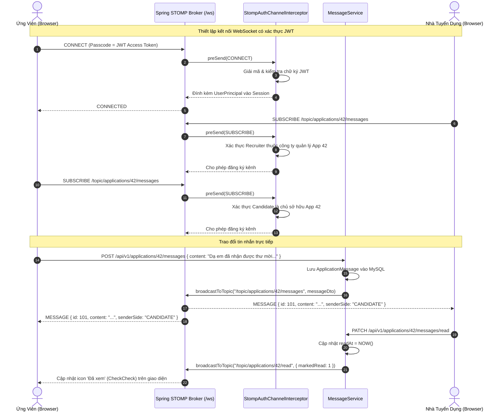

# Hệ Thống Nhắn Tin Thời Gian Thực STOMP WebSocket - TalentBridge

## 1. Tổng Quan Kiến Trúc WebSocket
Hệ thống trao đổi trực tiếp giữa Ứng viên và Hội đồng Tuyển dụng của **TalentBridge** được xây dựng trên giao thức **STOMP (Simple Text Oriented Messaging Protocol)** chạy qua tầng truyền tải **WebSocket** với cơ chế dự phòng **SockJS** fallback (`/ws`).

Mô hình này mang lại các ưu điểm vượt trội:
1. **Truyền tin thời gian thực hai chiều** (Full-duplex real-time) với độ trễ dưới 20ms.
2. **Kênh trao đổi riêng biệt theo từng hồ sơ ứng tuyển (`JobApplication`)**, cho phép hội đồng tuyển dụng (Admin, Recruiter, Interviewer) cùng đồng thời theo dõi và phản hồi ứng viên trên cùng một luồng hội thoại.
3. **Phân quyền và bảo mật nghiêm ngặt** tại tầng bắt chặn kênh STOMP (`StompAuthChannelInterceptor`), ngăn chặn rò rỉ dữ liệu giữa các doanh nghiệp.

---

## 2. Luồng Xử Lý Tin Nhắn Thời Gian Thực (Sequence Diagram)

---

## 3. Cấu Trúc Kênh Đăng Ký (Topics & Queues)

| Kênh (Destination) | Quyền Truy Cập | Mục Đích Sử Dụng | Payload Mẫu |
| :--- | :--- | :--- | :--- |
| `/topic/applications/{id}/messages` | Ứng viên sở hữu hồ sơ `{id}` & Thành viên đội ngũ công ty sở hữu tin tuyển dụng | Nhận tin nhắn mới tức thời trong hồ sơ ứng tuyển cụ thể | `MessageDto` (id, content, senderUserId, senderName, senderSide, createdAt, readAt) |
| `/topic/applications/{id}/read` | Các bên tham gia hồ sơ `{id}` | Thông báo tin nhắn đã được đối phương đọc (Seen/Read status) | `{ "applicationId": 42, "markedRead": 2 }` |
| `/topic/users/{userId}/notifications` | Riêng người dùng có `userId` tương ứng | Nhận thông báo chung, thông báo vòng tuyển dụng, huy hiệu chuông | `NotificationDto` (id, title, content, type, link, createdAt) |

---

## 4. Tầng Bảo Mật STOMP (`StompAuthChannelInterceptor`)

Để ngăn chặn lỗ hổng kẻ tấn công tự ý subscribe vào kênh hồ sơ của người khác (`IDOR - Insecure Direct Object Reference`), `StompAuthChannelInterceptor` thực hiện kiểm tra 2 lớp:
1. **Lớp 1: Giai đoạn Kết Nối (`StompCommand.CONNECT`)**:
   - Trích xuất token từ header `Authorization: Bearer <JWT>` hoặc STOMP passcode.
   - Xác thực token bằng `JwtTokenProvider`. Nếu không hợp lệ hoặc đã hết hạn, từ chối kết nối ngay lập tức (`MessageDeliveryException`).
2. **Lớp 2: Giai đoạn Đăng Ký Kênh (`StompCommand.SUBSCRIBE`)**:
   - Phân tích cú pháp đích (`destination`).
   - Nếu là `/topic/applications/{appId}/messages`:
     - Kiểm tra quyền của người dùng hiện tại đối với `JobApplication`: Phải là chính ứng viên nộp đơn, HOẶC là thành viên tích cực (`ACTIVE`) trong Đội ngũ Tuyển dụng (`HiringTeam`) của doanh nghiệp đăng tuyển vị trí đó.
     - Bất kỳ người dùng lạ nào cố gắng subscribe sẽ bị chặn với mã từ chối truy cập.

---

## 5. Trải Nghiệm Giao Diện Người Dùng (Dual-Pane UI)
- **Danh Sách Hội Thoại (Left Pane)**: Hiển thị danh sách các vị trí ứng tuyển, lọc theo tên/công ty/vị trí, hiển thị tin nhắn xem trước gần nhất, thời gian tương đối (`timeAgo`), và badge số tin nhắn chưa đọc màu xanh lục (`emerald-600`).
- **Khung Chat Chi Tiết (Right Pane)**:
  - Header hiển thị ảnh đại diện, tên đối tác, vị trí công việc, và badge trạng thái vòng tuyển dụng (`APPLIED`, `INTERVIEW`, `OFFERED`, v.v.).
  - Bong bóng tin nhắn thông minh: Tin nhắn của mình căn phải nền xanh (`emerald-600`), tin nhắn đối phương căn trái nền trắng/xám đậm.
  - Trạng thái đã xem: Hiển thị icon `CheckCheck` cùng nhãn "Đã xem" khi đối phương đã mở phòng chat.
  - Phím tắt tiện lợi: Phím `Enter` để gửi tin nhắn ngay lập tức, tổ hợp `Shift + Enter` để xuống dòng.
