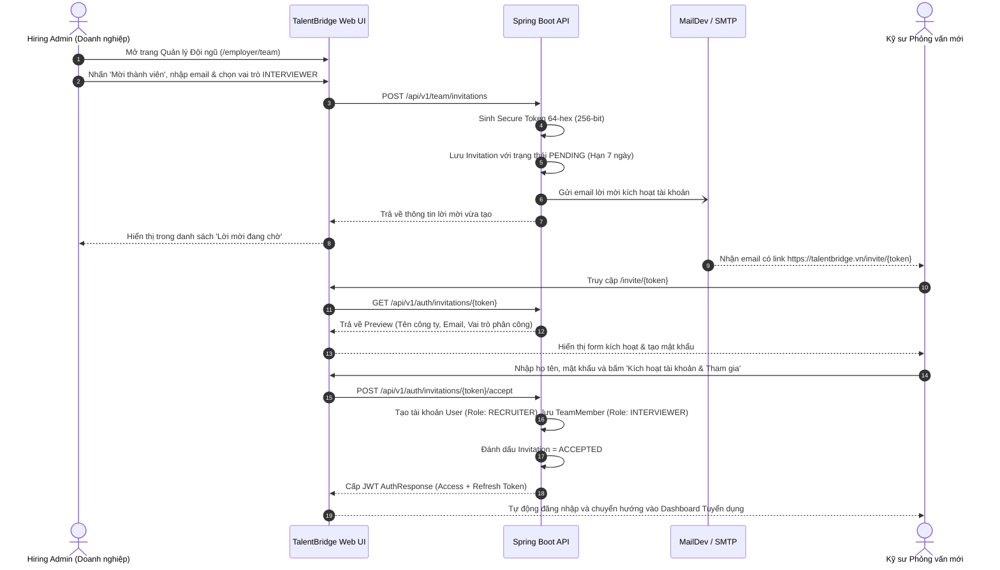

# Đội Ngũ Tuyển Dụng Doanh Nghiệp, Phân Quyền RBAC & Đánh Giá Phỏng Vấn - TalentBridge

## 1. Tổng Quan Kiến Trúc Đội Ngũ (Enterprise Hiring Team)
Trong tuyển dụng quy mô doanh nghiệp, việc phỏng vấn và ra quyết định không bao giờ do một cá nhân thực hiện mà luôn có sự phối hợp giữa:
- **Quản lý Tuyển dụng (Hiring Admin / Talent Acquisition Manager)**: Quản lý ngân sách, quản lý thành viên đội ngũ, phê duyệt cấu hình.
- **Chuyên viên Tuyển dụng (Recruiter)**: Quản lý nguồn ứng viên, sàng lọc hồ sơ, điều phối lịch hẹn và theo dõi các vòng thi.
- **Hội đồng Phỏng vấn Kỹ thuật (Technical Interviewers / Hiring Panelists)**: Các kỹ sư trưởng (Tech Lead, Senior Engineer) trực tiếp chấm điểm chuyên môn, điền bảng tiêu chí đánh giá (Rubric Scorecard), và ghi chú nội bộ.

**TalentBridge Phase 3** bổ sung cơ chế phân quyền đa cấp bậc (Multi-tier Role-Based Access Control - RBAC) lưu vết trong bảng `company_team_members` và `company_team_invitations`.

---

## 2. Ma Trận Phân Quyền (RBAC Permission Matrix)

| Hành Động Nghiệp Vụ | Quản Trị Viên (ADMIN) | Chuyên Viên Tuyển Dụng (RECRUITER) | Người Phỏng Vấn (INTERVIEWER) | Ứng Viên (CANDIDATE) |
| :--- | :---: | :---: | :---: | :---: |
| **Mời thành viên mới vào đội ngũ** | ✅ Có | ❌ Không | ❌ Không | ❌ Không |
| **Thay đổi vai trò / Xóa thành viên** | ✅ Có | ❌ Không | ❌ Không | ❌ Không |
| **Chỉnh sửa Hồ sơ Công ty (`/employer/company`)** | ✅ Có | ✅ Có | ❌ Không | ❌ Không |
| **Đăng tin / Đóng tin tuyển dụng** | ✅ Có | ✅ Có | ❌ Không | ❌ Không |
| **Xem danh sách ứng viên & CV chi tiết** | ✅ Có | ✅ Có | ✅ Có (Chỉ xem) | ❌ Không |
| **Chuyển vòng ứng tuyển (Move Stages)** | ✅ Có | ✅ Có | ❌ Không | ❌ Không |
| **Lên lịch / Dời lịch phỏng vấn (.ics)** | ✅ Có | ✅ Có | ❌ Không | ❌ Không |
| **Xem lịch phỏng vấn cá nhân (`/employer/interviews`)** | ✅ Có | ✅ Có | ✅ Có | ❌ Không |
| **Chấm điểm bảng tiêu chí (Rubric Scorecard)** | ✅ Có | ✅ Có | ✅ Có | ❌ Không |
| **Tạo ghi chú nội bộ toàn đội ngũ (Shared Note)** | ✅ Có | ✅ Có | ✅ Có | ❌ Không |
| **Tạo & xem ghi chú bí mật (Private Note)** | ✅ Xem tất cả | ✅ Chỉ của mình | ✅ Chỉ của mình | ❌ Không |
| **Trao đổi tin nhắn với ứng viên (`/messages`)** | ✅ Có | ✅ Có | ✅ Có | ✅ Có |

---

## 3. Quy Trình Mời & Kích Hoạt Thành Viên (Token Invitation Flow)

---

## 4. Hệ Thống Đánh Giá Tiêu Chuẩn (Rubric Scorecards)
Để tránh đánh giá cảm tính, mỗi buổi phỏng vấn hỗ trợ bảng chấm điểm Rubric đa chiều với thang điểm từ 1 đến 5:
1. **Technical Competence (Năng lực chuyên môn)**: Nắm vững thuật toán, cấu trúc dữ liệu, kiến trúc phần mềm, ngôn ngữ lập trình.
2. **Communication (Kỹ năng giao tiếp)**: Trình bày mạch lạc, giải thích vấn đề rõ ràng, biết lắng nghe.
3. **Problem Solving (Khả năng giải quyết vấn đề)**: Tư duy phản biện, cách tiếp cận bài toán chưa từng gặp, tối ưu hóa giải pháp.
4. **Culture Fit (Mức độ phù hợp văn hóa)**: Tinh thần học hỏi, khả năng làm việc nhóm, giá trị đạo đức nghề nghiệp.

**Khuyến nghị cuối cùng (Final Recommendation)**:
- `STRONG_HIRE` (Rất nên tuyển dụng)
- `HIRE` (Nên tuyển dụng)
- `NEUTRAL` (Cân nhắc / Phỏng vấn thêm)
- `NO_HIRE` (Không phù hợp)
- `STRONG_NO_HIRE` (Rất không phù hợp)

---

## 5. Ghi Chú Nội Bộ Bảo Mật (Internal Team Notes)
- **Ghi chú Toàn Đội Ngũ (Shared Notes)**: Được chia sẻ công khai cho mọi thành viên trong hội đồng tuyển dụng để cùng đồng bộ thông tin (VD: "Ứng viên yêu cầu dời phỏng vấn sau giờ hành chính", "Đã kiểm tra chứng chỉ ngoại ngữ hợp lệ").
- **Ghi chú Riêng Tư (Private Notes)**: Có ký hiệu ổ khóa vàng (`Lock`). Chỉ chính người viết ghi chú và **Quản trị viên (ADMIN)** mới có thể đọc được. Người phỏng vấn khác không thể xem được ghi chú này, bảo vệ các nhận xét nhạy cảm về mức lương kỳ vọng hoặc đánh giá tính cách.
